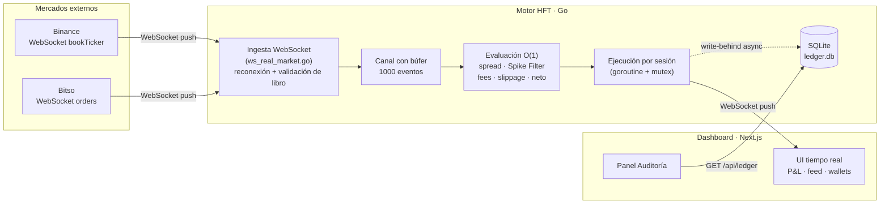
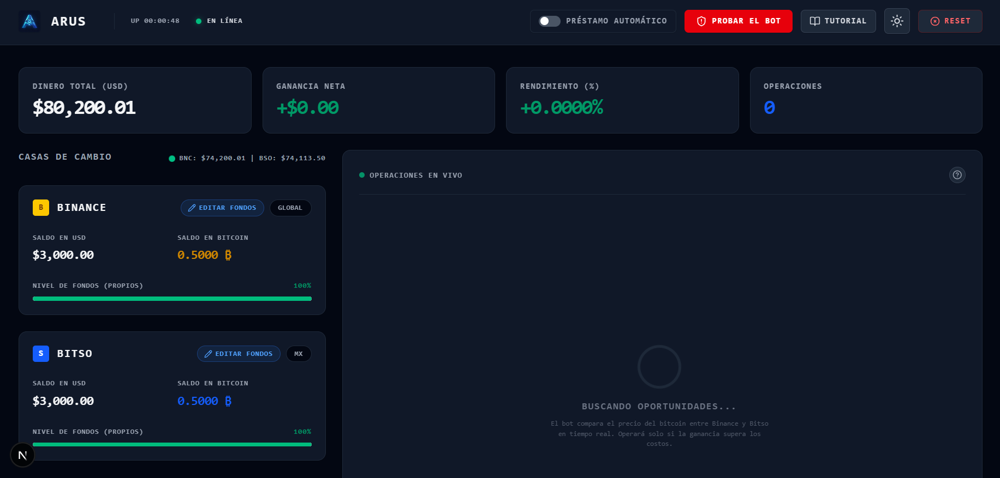
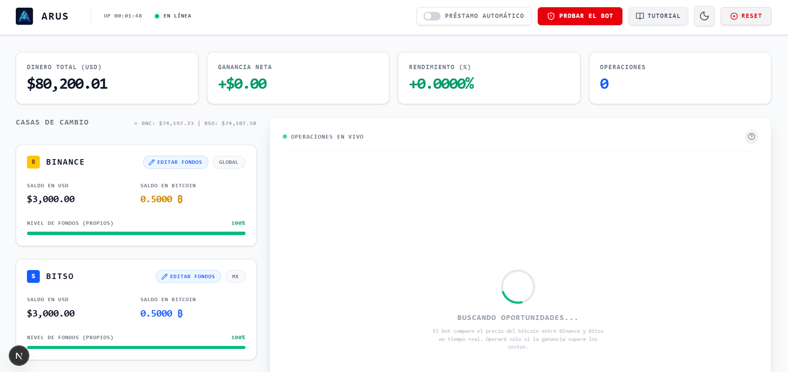
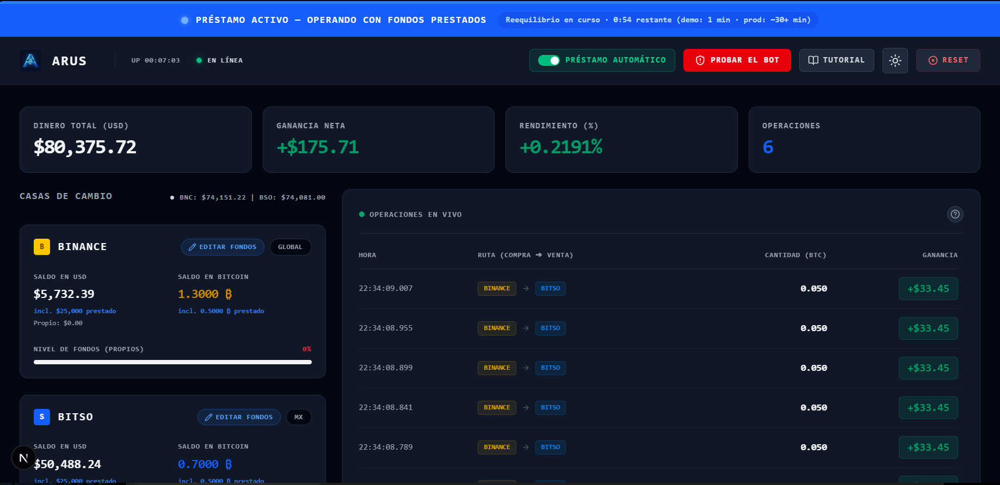
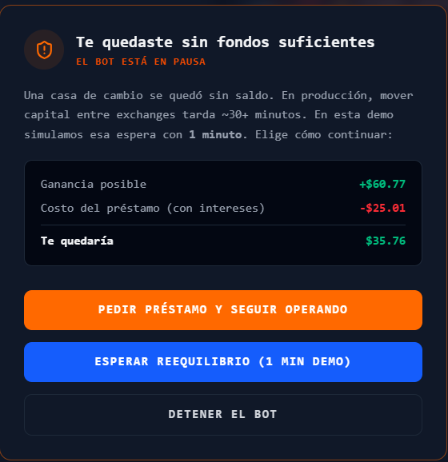
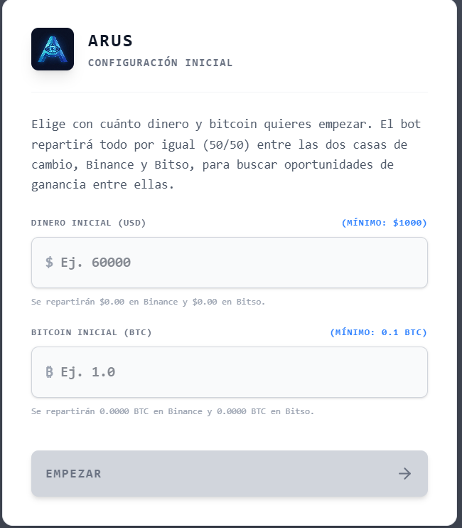
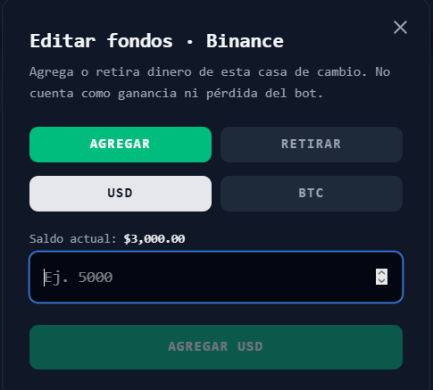
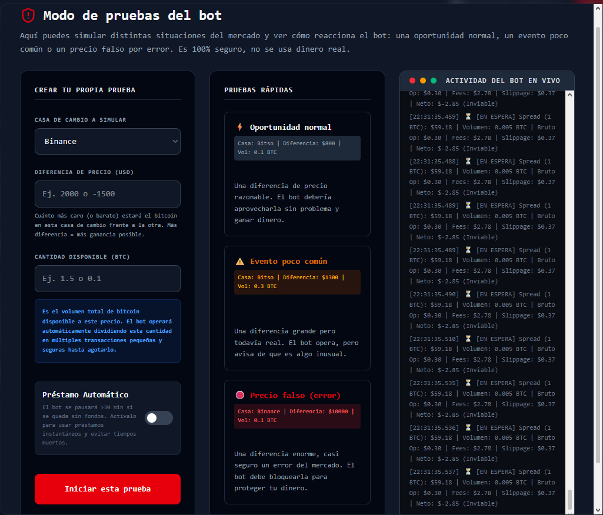

<div align="center">

# ⬡ ARUS

### Motor de arbitraje cross-exchange de alta frecuencia · Binance ↔ Bitso

*Detecta divergencias de precio de BTC entre dos mercados, descuenta cada fricción real (fees + slippage) y ejecuta solo cuando la ganancia neta es positiva — con gestión de inventario respaldada por crédito.*


**Autor:** Daniel Peredo Borgonio · **Reto:** CODING_CHALLENGE_MEXICO

🔗 **Demo en vivo:** _(pendiente de despliegue — ver [Despliegue](#-despliegue))_

</div>

---

## 📑 Índice

1. [Resumen ejecutivo](#-resumen-ejecutivo)
2. [El problema y la solución](#-el-problema-y-la-solución)
3. [Estrategia e inteligencia del bot](#-estrategia-e-inteligencia-del-bot)
4. [Velocidad y eficiencia](#-velocidad-y-eficiencia-detección-de-oportunidades)
5. [Precisión del cálculo de rentabilidad neta](#-precisión-del-cálculo-de-rentabilidad-neta)
6. [Robustez y gestión de riesgo](#-robustez-y-gestión-de-riesgo-circuit-breakers)
7. [Persistencia de datos](#-persistencia-de-datos-trade-ledger)
8. [Arquitectura y stack tecnológico](#-arquitectura-y-stack-tecnológico)
9. [Interfaz y experiencia de usuario](#-interfaz-y-experiencia-de-usuario)
10. [Instalación y ejecución local](#-instalación-y-ejecución-local)
11. [Despliegue](#-despliegue)
12. [Roadmap](#-roadmap)
13. [Capturas de pantalla](#-capturas-de-pantalla)
14. [Licencia](#-licencia)

---

## 🎯 Resumen ejecutivo

**Arus** es un motor de *arbitraje espacial* (cross-exchange) que opera el par **BTC/USD** simultáneamente en **Binance** y **Bitso**. Compra donde el bitcoin está más barato y vende donde está más caro en el mismo instante, con capital pre-posicionado en ambos exchanges para no depender de los tiempos de transferencia on-chain.

Su diferenciador no es detectar el spread —eso es trivial—, sino **modelar la física real del dinero**: descuenta las comisiones de cada plataforma y el slippage estimado *antes* de decidir, rechaza las "trampas de liquidez" (operaciones rentables en bruto pero negativas en neto) y, cuando un exchange se queda sin fondos, decide de forma autónoma si pedir un préstamo —solo si los intereses no se comen la ganancia— o reequilibrar el inventario.

---

## 💡 El problema y la solución

El error clásico del arbitraje novato es operar sobre el **spread bruto** (`Ask < Bid`) ignorando que cada operación tiene costos que pueden volverla negativa. Arus parte de modelar esos costos.

| | Arbitraje ingenuo | **Arus** |
|---|---|---|
| Señal de entrada | Spread bruto positivo | Spread **neto** > umbral tras fees + slippage |
| Comisiones | Se asumen "despreciables" | Modeladas por exchange (Binance 0.10 % / Bitso 0.65 %) |
| Slippage | Ignorado | Estimado (5 bps por pierna) y descontado antes de decidir |
| Anomalías de precio | Se opera sobre ellas | **Spike Filter** las bloquea (protección de capital) |
| Falta de fondos | Se detiene o falla | Decisión crédito-vs-reequilibrio con análisis de rentabilidad |
| Auditoría | Volátil / en memoria | **Ledger inmutable** persistido en disco |

---

## 🧠 Estrategia e inteligencia del bot

> **¿El bot detecta la primera oportunidad que aparece, o las prioriza y razona con una estrategia más sofisticada?**

Arus implementa **arbitraje cross-exchange (espacial)** sobre BTC/USD en Binance y Bitso: el modelo más directo y de menor riesgo de ejecución. Nuestra apuesta es deliberada: **la inteligencia no está en la *cantidad* de mercados, sino en la *calidad* de cada decisión.** El reto no es "ver" un spread —eso lo hace cualquiera—, sino resolver los sub-problemas que convierten un arbitraje *aparentemente obvio* en una pérdida real. Cada uno de ellos es una pieza de lógica de negocio que un bot ingenuo se salta.

**El modelo base:**

- **Un par, dos mercados:** BTC/USD en Binance (global) y Bitso (México). No es triangular (no usa tres pares), no es estadístico (no usa correlaciones ni modelos predictivos) y no toca derivados — es **precio A vs precio B en tiempo real**, honesto sobre lo que sí y lo que no hace.
- **Fondos pre-posicionados:** ambos lados mantienen USD y BTC, de modo que la compra y la venta son **simultáneas**; la ganancia se realiza sin esperar confirmaciones de la red Bitcoin.

**Los cuatro sub-problemas que resolvemos dentro del problema principal:**

1. **«¿En qué dirección?»** — En cada tick evalúa las **dos** direcciones (`Binance→Bitso` *y* `Bitso→Binance`) y ejecuta la de **mayor neto**, no la primera que aparece ni la de mayor spread *bruto*. Es priorización, no reacción.
2. **«¿Es rentable de verdad?»** — Decide sobre el **neto estricto** (fees de ambas piernas + slippage), descartando las "trampas de liquidez" rentables en bruto pero negativas en neto → ver [Precisión](#-precisión-del-cálculo-de-rentabilidad-neta).
3. **«¿Y si el dato está roto?»** — Spike Filter + compuerta de divergencia >20 % protegen el capital ante feeds corruptos y *flash crashes* → ver [Robustez](#-robustez-y-gestión-de-riesgo-circuit-breakers).
4. **«¿Qué hago cuando un exchange se queda sin inventario?»** — Aquí está nuestro **diferenciador** ⤵️

### ⭐ El diferenciador: capa de inteligencia financiera (crédito vs. reequilibrio)

En el arbitraje real existe un enemigo silencioso: el **tiempo muerto**. Cuando un exchange agota su inventario, reponerlo exige una transferencia on-chain de **~30+ minutos**, y durante esa espera el capital queda ocioso mientras las oportunidades —que viven milisegundos— se evaporan. La mayoría de los bots simplemente **se detienen**.

Arus no se detiene: **razona**. Modela una línea de crédito instantánea (`$50 000 USD` + `1 BTC`, con comisión de originación `$25` y APR `10 %` prorrateado al plazo, vía `calculateCreditCost`) y decide de forma autónoma según un interruptor de negocio configurable:

- **Préstamo automático ON:** si la **ganancia proyectada supera el costo del crédito** (originación + intereses), pide la línea al instante y sigue operando *mientras* se reequilibra el inventario en segundo plano; si **no** lo supera, pausa y reequilibra 50/50 — **nunca se endeuda a pérdida**.
- **Préstamo automático OFF:** el bot cede la decisión al usuario con un diálogo informado: *pedir el préstamo* (habilitado **solo** si es rentable), *esperar el reequilibrio* (~1 min en demo, ~30+ min en producción, con cuenta regresiva) o *detener el bot*.

El préstamo es **siempre temporal**: al vencer el plazo se devuelve y el inventario vuelve a 50/50 (ver [Robustez](#-robustez-y-gestión-de-riesgo-circuit-breakers)). En la práctica, esto convierte los minutos muertos de la competencia en **minutos productivos**, sin asumir nunca apalancamiento que erosione la ganancia.

---

## ⚡ Velocidad y eficiencia (detección de oportunidades)

> **¿Con qué latencia identifico una divergencia? ¿WebSockets o polling? ¿Cómo optimizo el tiempo real?**

**Núcleo de detección — latencia medida, no estimada.** El cálculo que identifica y evalúa una oportunidad por cada tick (mids, spreads en ambas direcciones, media móvil del Spike Filter, fees, slippage, neto y decisión de viabilidad) es **O(1)** y está libre de asignaciones en el *hot path*:

```
BenchmarkOpportunityDetection-12   ~21 ns/op   16 B/op   0 allocs/op
(Intel i5-12450H · go test -bench · ~21–24 ns/op en corridas sostenidas)
```

≈ **40–47 millones de evaluaciones por segundo y por núcleo**, con **cero asignaciones** en el camino crítico. Reproducible con:

```bash
cd apps/engine && go test -bench=Detection -benchmem -run=^$
```

**Ingesta de datos — 100 % WebSocket nativo, sin polling.** El motor abre una conexión *push* directa a cada exchange y reacciona en el instante en que cambia el libro:

| Plano | Mecanismo | Endpoint / canal | Latencia |
|---|---|---|---|
| Exchanges → motor | **WebSocket nativo** | Binance `wss://stream.binance.com:9443/ws/btcusdt@bookTicker` · Bitso `wss://ws.bitso.com` (canal `orders`) | Tiempo de red — push en cada cambio del *top-of-book* |
| Motor → navegador | **WebSocket** | `/ws` (gorilla) | Operaciones y alertas: **inmediatas**. Precio de mercado: coalescido a ~1/s para no saturar la UI |

> Cada cambio en el mejor bid/ask llega en cuanto ocurre, sin ningún intervalo de sondeo. Las conexiones se **reconectan solas** (espera de 3 s entre intentos, *read-deadline* de 70 s para detectar conexiones muertas) y **validan la coherencia del libro** —ambos lados positivos, no cruzado (`ask ≥ bid`) y spread interno < 5 %— *antes* de alimentar la detección, descartando ticks corruptos en el origen (`coherentBook` en `ws_real_market.go`).

**Optimizaciones de tiempo real (verificables en el código):**
- **Canal con búfer (1 000 eventos)** entre la ingesta y el procesamiento (`main.go`) → *zero-sampling-loss* en picos de volatilidad.
- **Media móvil del Spike Filter O(1)** sobre ventana fija de 20 muestras (`SpreadTracker`): sin recorrer históricos en el *hot path*.
- **Una goroutine por sesión** para la ejecución (`go e.executeForSession`), sin bloquear el bucle global de evaluación.
- **Escritura del ledger "write-behind"** (asíncrona, `recordTradeAsync`): persistir en disco nunca frena la siguiente operación.

---

## 🎯 Precisión del cálculo de rentabilidad neta

> **¿Consideras los fees, el slippage y el riesgo de ejecución antes de decidir? ¿Evitas operaciones rentables en bruto pero negativas en neto?**

La decisión de ejecutar se toma sobre el **neto estricto**, nunca sobre el bruto:

```
Neto = (Spread × Volumen) − Fees(ambos exchanges) − Slippage estimado
```

- **Fees por exchange, en las dos piernas:** taker de Binance `0.10 %` y de Bitso `0.65 %`. No se asumen "simétricos": la pierna de **compra** encarece el costo (`precio × volumen × (1 + fee)`) y la de **venta** reduce el ingreso (`precio × volumen × (1 − fee)`), tal como cobra cada exchange.
- **Slippage estimado:** `5 bps por pierna` sobre el notional ejecutado (`estimateSlippage`). Modela que una orden de mercado no se llena íntegra en el *top-of-book*, sino que consume varios niveles y empeora el precio promedio. Se **descuenta antes de decidir** — incluso en la proyección que dispara la solicitud de préstamo.
- **Las dos direcciones, cada tick:** el motor calcula el neto de `Binance→Bitso` **y** de `Bitso→Binance` y solo opera la de mayor neto (`netProfit1` vs `netProfit2`), nunca la primera que aparece.
- **Umbral de viabilidad:** una operación se ejecuta solo si su neto supera `$0.10`. Una divergencia con spread bruto de, p. ej., `$2.81` pero `$2.78` de fricciones se clasifica `[EN ESPERA] (Inviable)` y **se bloquea**, evitando el *fee bleeding*.
- **Cálculo auditable, no caja negra:** cada evaluación se emite al feed en vivo con su **desglose completo** —`Bruto | Fees | Slippage | Neto`— de modo que el jurado (o cualquier usuario) ve *por qué* una oportunidad se ejecutó o se descartó, en el instante en que ocurre.
- **P&L limpio:** la *Ganancia Neta* refleja **solo el resultado del trading**. La base de cálculo (`InitialWealth`) es un escalar en USD que se mueve junto con los depósitos/retiros, por lo que agregar o quitar capital **no distorsiona** el rendimiento mostrado (que el dashboard muestra con 4 decimales de precisión).

¿Es buena idea ejecutar? La respuesta del motor es sí **únicamente** cuando `Neto > umbral`; y para apalancarse con crédito, solo cuando `Ganancia proyectada > Costo del crédito (intereses incluidos)`.

---

## 🛡️ Robustez y gestión de riesgo (circuit breakers)

> **¿Cómo manejas baja liquidez, órdenes parciales y movimientos bruscos? ¿Hay circuit breaker?**

- **Spike Filter (circuit breaker de precio):** un tick cuya variación supere el **5 %** respecto al anterior se descarta como dato corrupto. Además, se mide el spread contra su **media móvil**:
  - factor **> 15×** → `[SPIKE ALERTA]` (evento extremo, se opera con aviso).
  - factor **> 50×** → `[SPIKE BLOQUEADO]` (probable error de API / flash crash → **se rechaza** para proteger el capital y evitar exchanges insolventes).
- **Doble compuerta de cordura de precio:** más allá del factor contra la media móvil, antes de ejecutar el motor descarta cualquier par de precios cuya divergencia entre exchanges supere el **20 %** (`bitAsk > binAsk*1.20`). Es la segunda barrera: si el feed de un exchange se rompe por completo, la operación se aborta **antes** de tocar las wallets, no después.
- **Baja liquidez y órdenes parciales:** la liquidez disponible se consume en **chunks** pequeños; antes de *cada* chunk se valida el saldo real (*hard block*), de modo que el motor nunca ejecuta lo que no puede fondear. Si el inventario se agota a mitad de una oportunidad, entra la lógica de crédito/reequilibrio.
- **Validación de fondos en profundidad (doble *hard block*):** el saldo se comprueba al evaluar la oportunidad y **otra vez** justo antes de mover las wallets (`sessionHasFundsForTrade`). Si en ese microinstante el inventario ya no alcanza, la operación se marca `[BLOQUEADO]` y se deriva a la lógica de crédito/reequilibrio — el motor jamás permite un saldo negativo.
- **Ritmo de ejecución (anti-*overtrading*):** un *cooldown* de **3 s** entre operaciones por sesión evita martillar el mismo spread persistente y vaciar el inventario en una ráfaga sobre una señal que quizá ya caducó.
- **Protección contra apalancamiento perdedor:** no se pide ningún préstamo cuyo costo (intereses incluidos) supere la ganancia esperada.
- **Recuperación tras agotar el crédito:** si el bot consume los fondos prestados, entra en estado `[CRÉDITO AGOTADO]` y **pausa** hasta que vence el plazo; entonces devuelve el préstamo y reequilibra el inventario 50/50 (`rebalanceWallets50_50`). El apalancamiento es siempre temporal y se cierra solo, nunca queda abierto indefinidamente.
- **Concurrencia segura:** estado por sesión protegido con mutex; correcciones de punto flotante (`clampWallet`) para evitar saldos negativos espurios por *dust* de redondeo.

---

## 💾 Persistencia de datos (Trade Ledger)

En lugar de un sistema de usuarios/login (que no aporta valor a un motor HFT), Arus persiste un **Trade Ledger**: un registro de auditoría **inmutable** de cada operación.

- **Motor de almacenamiento:** **SQLite** vía `modernc.org/sqlite` — **Go puro, sin CGO**, por lo que el despliegue no requiere contenedores ni toolchain de C. La base vive en `apps/engine/data/ledger.db` (modo WAL).
- **Escritura asíncrona (write-behind):** tras emitir cada operación por WebSocket, una goroutine inserta el `TradeRecord` sin bloquear la ejecución del siguiente chunk.
- **Qué se audita:** id, sesión, timestamp, exchanges de compra/venta, volumen, spread, neto y un flag `is_credit_injection` (distingue trades reales de préstamos/reequilibrios).
- **Endpoint de consulta:** `GET /api/ledger` devuelve los últimos 100 registros en JSON.
- **Verificado:** los registros **sobreviven al reinicio del motor y del navegador**. El dashboard los muestra en el panel *Historial / Auditoría*.

---

## 🏗️ Arquitectura y stack tecnológico

> **¿El sistema está bien estructurado, es mantenible y escalable? ¿El código es legible y sigue buenas prácticas?**

El motor sigue una **separación de responsabilidades por archivo** (cada uno hace una cosa) y un **pipeline orientado a eventos**: las goroutines de ingesta empujan a un canal con búfer, un único bucle de detección evalúa cada tick, y la ejecución se reparte por sesión. Nada de lógica de negocio mezclada con transporte ni con persistencia.



**¿Por qué este stack?**

| Capa | Tecnología | Justificación |
|---|---|---|
| Motor | **Go 1.26** | Concurrencia nativa (goroutines + channels) ideal para un bucle de eventos sin bloqueos; binarios estáticos triviales de desplegar. |
| Comunicación | **WebSocket** (`gorilla/websocket`) | Tiempo real en ambos extremos: ingesta de precios de los exchanges (Binance/Bitso) y push al navegador, sin polling. |
| Persistencia | **SQLite** (`modernc.org/sqlite`) | Driver **CGO-free**: persistencia real sin Postgres ni contenedores, despliegue de un solo binario. |
| Frontend | **Next.js 16 / React 19** | App Router, renderizado del lado del servidor y DX moderna. |
| Estilos | **Tailwind CSS 4** + `lucide-react` | UI consistente, responsive y con modo oscuro. |
| Tipado | **TypeScript** | Contratos de datos seguros entre motor y UI. |

**Organización del repositorio:**

```
Arus/
├─ apps/
│  ├─ engine/                 # Motor HFT en Go — capas separadas por archivo
│  │  ├─ main.go              # Composition root: crea el canal, el Hub y el motor, cablea rutas /ws y /api/ledger, lee PORT y arranca las goroutines
│  │  ├─ engine.go            # DOMINIO: bucle de detección (Start), ejecución por sesión, fees+slippage, Spike Filter y toda la lógica de crédito/reequilibrio
│  │  ├─ server.go            # TRANSPORTE: upgrade WS, init de sesión, router de acciones del cliente y handler HTTP del ledger (CORS)
│  │  ├─ ledger.go            # PERSISTENCIA: esquema SQLite, write-behind (recordTradeAsync) y consulta (getRecentTrades)
│  │  ├─ models.go            # CONTRATOS y ESTADO: tipos de wire (ClientMessage/ServerEvent/LogEvent), ClientSession, el Hub multi-sesión y las constantes de negocio
│  │  ├─ ws_real_market.go    # INGESTA: streams WebSocket de Binance/Bitso, reconexión y validación de libro (coherentBook)
│  │  └─ engine_bench_test.go # Benchmark de latencia del núcleo de detección
│  └─ web/                    # Dashboard en Next.js
│     └─ src/
│        ├─ app/              # page.tsx (dashboard, presentacional) + layout
│        ├─ components/       # OnboardingModal · TutorialModal · LedgerPanel
│        │                    #   (StrategyGuide/Funds/InsufficientFunds Modals viven en page.tsx)
│        ├─ hooks/            # useArusEngine: única fuente de verdad (dueño del WebSocket + reducer de eventos → estado)
│        └─ lib/              # config.ts (endpoints del motor por variable de entorno)
└─ README.md
```

**Principios de diseño y convenciones que seguimos:**

- **Separación por capas, no por conveniencia.** El dominio (`engine.go`) no sabe nada de HTTP; el transporte (`server.go`, `ws_real_market.go`) no toma decisiones de negocio; la persistencia (`ledger.go`) es auxiliar y su fallo **nunca** detiene el trading. Los tipos de wire y el estado viven aislados en `models.go`, de modo que el contrato motor↔UI es un único punto de verdad.
- **Multi-tenant desde el diseño.** Un `Hub` (protegido por `RWMutex`) mantiene una `ClientSession` por navegador, cada una con sus propias wallets y estado de crédito. El bucle de detección evalúa el mercado **una sola vez por tick** y luego ejecuta **por sesión** en goroutines independientes — el costo de detección no escala con el número de clientes.
- **Disciplina de concurrencia explícita.** Estado de sesión bajo `session.Mu`, escrituras al socket serializadas con `ConnMu` (evita el *interleaving* que corrompe frames de Gorilla), y persistencia *write-behind* para no bloquear el *hot path*.
- **Contratos tipados de extremo a extremo.** Las acciones entrantes (`ClientMessage`) y los eventos salientes (`ServerEvent`/`LogEvent`) están tipados en Go y reflejados en las `interface`s de TypeScript (`EngineState`, `Trade`, `LogEntry`), de modo que un cambio en el protocolo se nota en compilación, no en runtime.
- **Frontend con una única fuente de verdad.** Todo el estado vive en el hook `useArusEngine`: es dueño del ciclo de vida del WebSocket (con **reconexión automática a 3 s**) y despacha cada evento del servidor a un *patch* inmutable de estado, al estilo *reducer*. `page.tsx` y los modales son puramente presentacionales.
- **Comentarios que explican el *por qué*, no el *qué*.** Las funciones y tipos exportados llevan doc-comments en español que documentan decisiones y *gotchas* reales —por ejemplo, por qué se declaran los 4 campos del `bookTicker` de Binance (el matching JSON de Go es *case-insensitive* y las cantidades sobreescribían los precios), o por qué SQLite se limita a `SetMaxOpenConns(1)` con `busy_timeout`.
- **Observabilidad por convención de *tags*.** Cada evento relevante se registra con una etiqueta consistente (`[OPORTUNIDAD]`, `[ARBITRAJE]`, `[SPIKE BLOQUEADO]`, `[CRÉDITO ACTIVADO]`…) que `getLevel()` traduce a niveles de color para el feed de la UI — los mismos logs sirven para depurar en consola y para narrar al usuario lo que ocurre.

---

## 🖥️ Interfaz y experiencia de usuario

Web app accesible desde el navegador, pensada para que **cualquiera** entienda lo que ocurre (textos en lenguaje claro, no solo para expertos):

- **P&L acumulado en tiempo real:** dinero total, ganancia neta y rendimiento (%).
- **Estado del mercado en vivo:** precios de Binance/Bitso y spread, con indicador de *ping*.
- **Feed de operaciones ejecutadas:** ruta (compra → venta), volumen y ganancia neta de cada trade.
- **Salud de inventario por exchange** y distribución del capital (USD/BTC).
- **Editar fondos (depósito / retiro):** botón en cada exchange para agregar o retirar USD o BTC. El ajuste mueve la base del PnL por igual, de modo que **un depósito/retiro nunca se cuenta como ganancia ni pérdida**.
- **Tutorial guiado (8 pasos):** en el primer ingreso (y desde el botón «Tutorial») un recorrido en **lenguaje sencillo** —sin jerga— que señala con un chip *📍 dónde está* cada elemento (saldos, «Editar fondos», «Probar el bot», feed, auditoría). Se recuerda en `localStorage` para no repetirse.
- **Guía de estrategia (botón «?»):** explica el arbitraje con un **ejemplo visual** (comprar barato en una casa, vender caro en la otra *al mismo tiempo*) y desglosa las **3 condiciones de rentabilidad** (spread real · superar comisiones · liquidez en ambas casas), además de la *ventaja del bot* (crédito instantáneo vs. los ~30 min de un traslado on-chain, y el filtro anti–precio-falso).
- **Configuración inicial guiada:** al entrar, un modal pide el capital de arranque (mín. `$1 000` y `0.1 BTC`) y muestra en vivo cómo se repartirá 50/50 entre Binance y Bitso antes de confirmar.
- **Panel de Historial / Auditoría:** lee el ledger persistido (`/api/ledger`).
- **Modo de pruebas (Simulador):** inyecta escenarios (oportunidad normal, evento extremo, precio falso) para ver al Spike Filter y a la lógica de crédito en acción — sin dinero real.
- **Decisión asistida al quedarse sin fondos:** un diálogo ofrece *pedir préstamo* (solo si es rentable), *esperar el reequilibrio* (1 min en demo, ~30+ min en producción, con cuenta regresiva) o *detener el bot*.
- **Modo oscuro, diseño responsive** y banner de préstamo activo con cuenta regresiva.

---

## 🚀 Instalación y ejecución local

> Objetivo: sistema funcional en **menos de 2 minutos**. No se requiere Docker ni base de datos externa — la persistencia es SQLite embebido.

### Prerrequisitos

| Software | Versión | Verificar |
|---|---|---|
| **Go** | 1.26+ | `go version` |
| **Node.js** | 18+ (probado en 24) | `node -v` |
| **npm** | 9+ | `npm -v` |

### 1) Motor HFT (backend en Go)

```bash
cd apps/engine
go run .
# Servidor en :8080 — crea automáticamente data/ledger.db
```

### 2) Dashboard (frontend en Next.js)

```bash
cd apps/web
npm install
npm run dev
# Abre http://localhost:3000
```

### 3) Probar la persistencia (opcional)

1. En la UI, abre **Probar el bot → Oportunidad normal** para generar trades.
2. Despliega el panel **Historial / Auditoría**.
3. Reinicia el motor (`Ctrl+C` y `go run .` de nuevo) y vuelve a abrir el panel: **los registros siguen ahí**.

### Reproducir el benchmark de latencia

```bash
cd apps/engine && go test -bench=Detection -benchmem -run=^$
```

---

## ☁️ Despliegue

Arquitectura de dos servicios. Stack gratuito recomendado:

| Componente | Plataforma | Por qué |
|---|---|---|
| **Frontend** (Next.js) | **Vercel** | Soporte nativo de Next.js, CI/CD desde Git, HTTPS automático, free tier amplio. |
| **Motor** (Go + SQLite) | **Railway** | Proceso de larga vida con WebSocket, dominio con TLS (habilita `wss://`) y **volumen persistente** para conservar `ledger.db`. *(Fly.io es alternativa equivalente.)* |

> ⚠️ Para que SQLite persista entre reinicios en la nube, monta un **volumen** en la ruta `data/` del motor. Render (free) y Cloud Run no ofrecen disco persistente gratuito, por lo que no se recomiendan para el ledger.

**Pasos resumidos:**

1. **Motor en Railway:** desplegar `apps/engine` (build `go build`, start `./arus-engine`); Railway inyecta `PORT` (ya soportado). Montar volumen en `data/`. Anotar el dominio público (p. ej. `arus-engine.up.railway.app`).
2. **Frontend en Vercel:** importar `apps/web` y definir las variables de entorno (ver `apps/web/.env.example`):
   ```
   NEXT_PUBLIC_ENGINE_WS_URL=wss://arus-engine.up.railway.app/ws
   NEXT_PUBLIC_ENGINE_HTTP_URL=https://arus-engine.up.railway.app
   ```
3. Abrir la URL de Vercel — el dashboard se conecta al motor por `wss://` y lee el ledger por `https://`.

---

## 🗺️ Roadmap

- [x] ~~Migrar la ingesta de precios a WebSockets nativos~~ — **hecho**: streams `bookTicker` (Binance) y `orders` (Bitso) por WebSocket, con reconexión y validación de libro.
- [ ] Modelo de slippage por **profundidad de order book** real (hoy es una estimación lineal en bps).
- [ ] Más pares y exchanges; evaluación de **arbitraje triangular**.
- [ ] Persistencia por cliente (filtrado del ledger por `session_id` almacenado en el navegador).
- [ ] Suite de tests unitarios además del benchmark de latencia.

---

## 📸 Capturas de pantalla

### Panel principal en tiempo real

El dashboard reúne el P&L acumulado (dinero total, ganancia neta y rendimiento), la salud de inventario por exchange y el feed de operaciones en vivo, con precios de Binance/Bitso e indicador de *ping*.



<sub>Modo claro disponible con un clic — diseño responsive y *dark mode* nativo:</sub>



### ⭐ El diferenciador en acción: crédito vs. tiempo muerto

Con la línea de crédito activa, el bot **sigue operando** (banner superior con cuenta regresiva) mientras el inventario se reequilibra en segundo plano. En la captura acumula **+$175.71 netos en 6 operaciones**, y cada wallet muestra cuánto capital es propio y cuánto prestado.



Cuando un exchange se queda sin saldo y el préstamo automático está apagado, el bot **cede la decisión al usuario** con los números sobre la mesa: ganancia posible, costo del crédito y resultado neto si se pide.

<p align="center">
  
</p>

### Onboarding y tutorial guiado

<table>
<tr>
<td width="50%" valign="top"><br><sub>Configuración inicial: el usuario elige capital de arranque (mín. $1 000 y 0.1 BTC) y ve cómo se repartirá 50/50.</sub></td>
<td width="50%" valign="top"><br><sub>Tutorial guiado de 8 pasos en lenguaje sencillo, con chip de ubicación de cada elemento.</sub></td>
</tr>
</table>

### Gestión de fondos y modo de pruebas

<table>
<tr>
<td width="42%" valign="top"><br><sub>Depósito/retiro por exchange (USD o BTC): ajusta la base del P&L para que no cuente como ganancia ni pérdida.</sub></td>
<td width="58%" valign="top"><br><sub>Simulador: inyecta escenarios (oportunidad normal, evento extremo, precio falso) para ver al Spike Filter y a la lógica de crédito en acción.</sub></td>
</tr>
</table>

---

## 📄 Licencia

Este proyecto se distribuye bajo la **licencia MIT** — eres libre de usar, copiar, modificar y distribuir el código, citando la autoría. El texto completo está en el archivo [`LICENSE`](LICENSE).

---

<div align="center">

**Arus** · CODING_CHALLENGE_MEXICO · Daniel Peredo Borgonio · Licencia MIT

</div>
