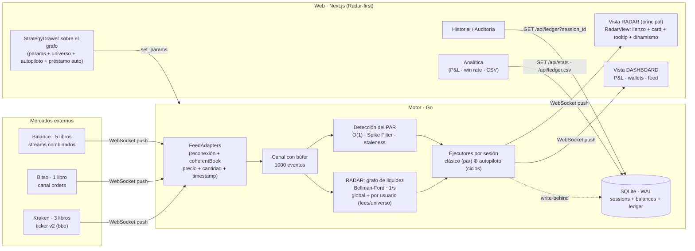
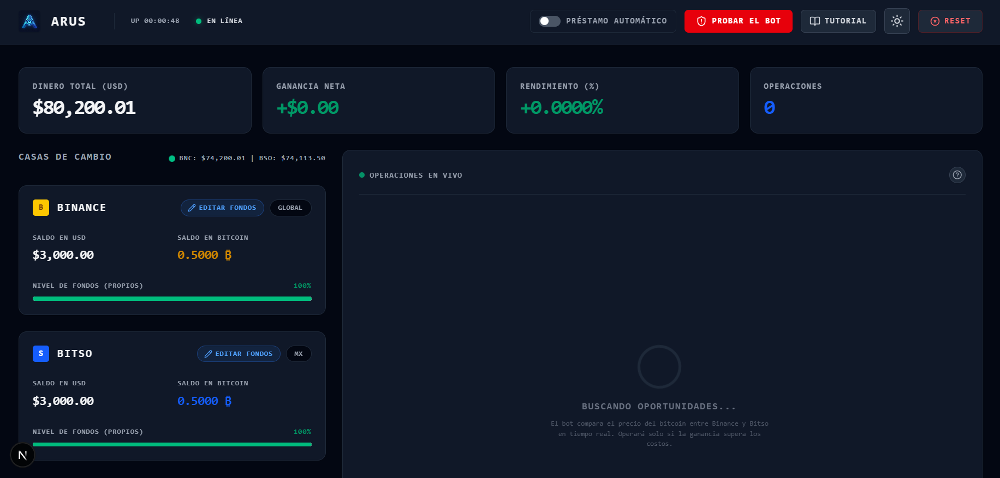
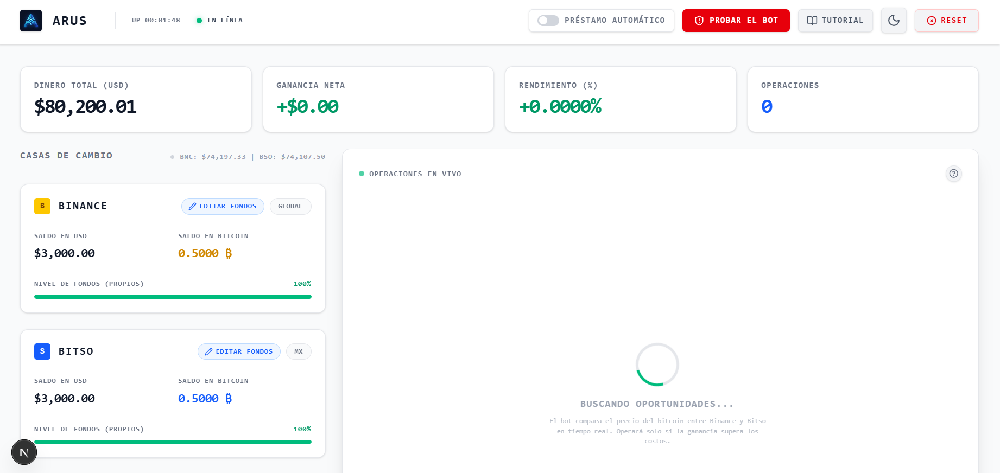
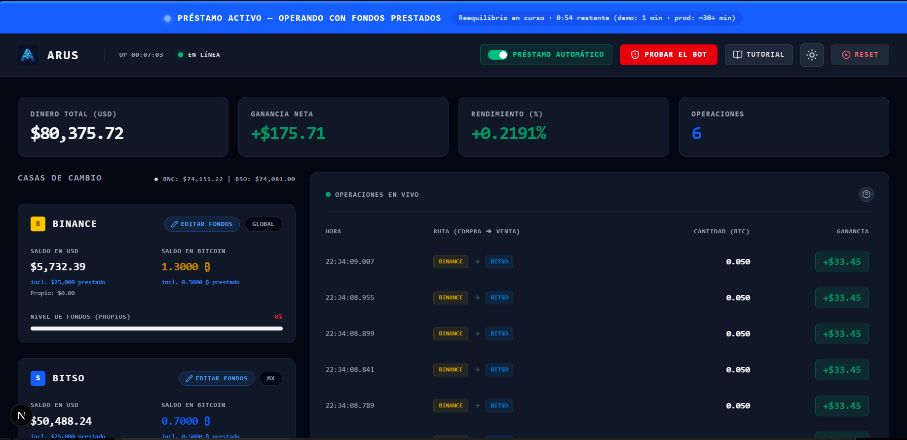
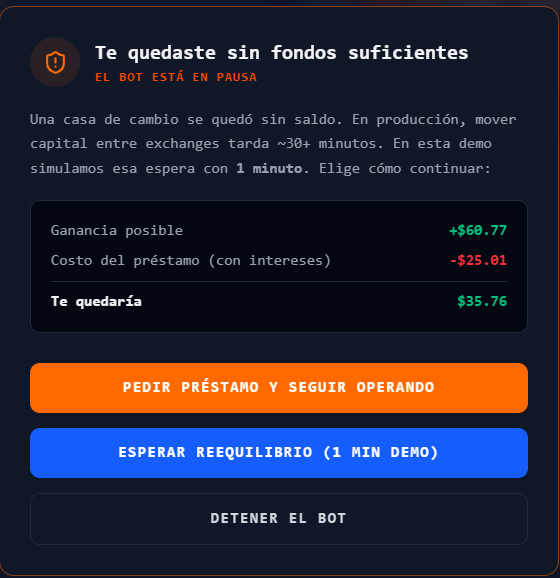
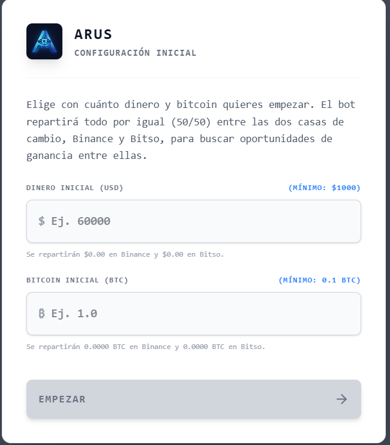
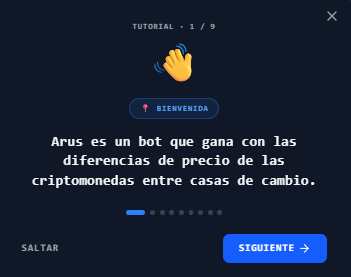
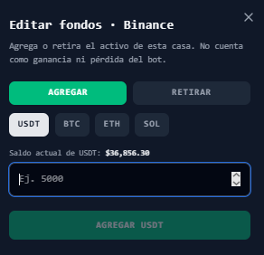
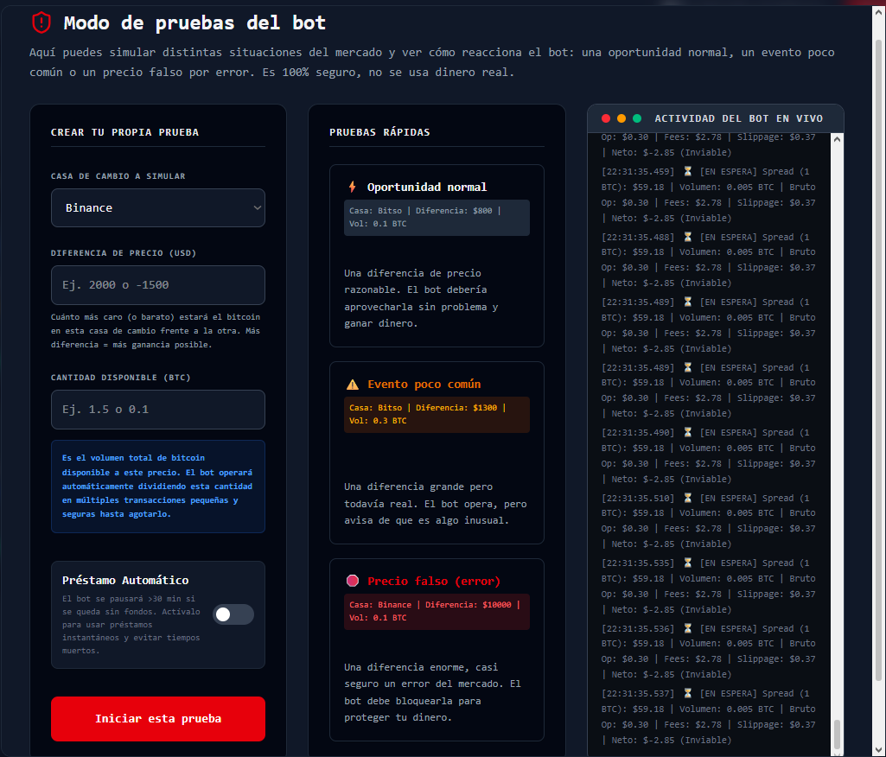

<div align="center">

# ⬡ ARUS

### Motor de arbitraje omnidireccional de alta frecuencia · multi-exchange · multi-activo

> ### 🚧 TRABAJO EN CURSO — pendiente a continuación
> Rama `feat/arbitraje-omnidireccional`. Este README es la **referencia completa del proyecto** (documento de handoff: se puede retomar el trabajo leyendo solo esto): qué hay construido, cómo funciona y qué sigue. Los Sprints C y D (Kraken, SOL, crédito para ciclos, analítica) **y el rediseño Radar-first de la UI** (el grafo es ahora la pantalla principal) ya están integrados y verificados. Queda: desplegar la rama, **actualizar las capturas** (las actuales son de la versión anterior) y la sesión de revisión multi-agente. Ver [Estado de la rama](#-estado-de-la-rama-bitácora) y [Qué sigue](#-qué-sigue--plan-de-evolución).

*Un grafo de liquidez en vivo detecta ciclos de arbitraje —espaciales entre exchanges y triangulares dentro de uno— con datos 100 % reales de **Binance, Bitso y Kraken**, descuenta cada fricción (fees + slippage) y ejecuta solo cuando la ganancia neta supera el margen que **cada usuario** define. Sesiones completas persistidas: el bot te recuerda.*


**Autor:** Daniel Peredo Borgonio · **Reto:** CODING_CHALLENGE_MEXICO

🔗 **Demo en vivo:** **[arus-snowy.vercel.app](https://arus-snowy.vercel.app)** *(⚠️ el deploy corre la versión de `main`; esta rama aún no se despliega)* · ⚙️ Motor (API): [arus-engine.fly.dev/api/ledger](https://arus-engine.fly.dev/api/ledger)

</div>

---

## 📑 Índice

1. [Estado de la rama (bitácora)](#-estado-de-la-rama-bitácora)
2. [Resumen ejecutivo](#-resumen-ejecutivo)
3. [El problema y la solución](#-el-problema-y-la-solución)
4. [Estrategia e inteligencia del bot](#-estrategia-e-inteligencia-del-bot)
5. [El Radar Omnidireccional (grafo de liquidez)](#-el-radar-omnidireccional-grafo-de-liquidez)
6. [Velocidad y eficiencia](#-velocidad-y-eficiencia-detección-de-oportunidades)
7. [Precisión del cálculo de rentabilidad neta](#-precisión-del-cálculo-de-rentabilidad-neta)
8. [Robustez y gestión de riesgo](#-robustez-y-gestión-de-riesgo-circuit-breakers)
9. [Persistencia y continuidad](#-persistencia-y-continuidad-sesiones-completas--trade-ledger)
10. [Arquitectura y stack tecnológico](#-arquitectura-y-stack-tecnológico)
11. [Interfaz y experiencia de usuario](#-interfaz-y-experiencia-de-usuario)
12. [Parámetros y configuración — referencia completa](#️-parámetros-y-configuración--referencia-completa)
13. [Instalación y ejecución local](#-instalación-y-ejecución-local)
14. [Despliegue](#-despliegue)
15. [Qué sigue — plan de evolución](#-qué-sigue--plan-de-evolución)
16. [Capturas de pantalla](#-capturas-de-pantalla)
17. [Licencia](#-licencia)

---

## 🚧 Estado de la rama (bitácora)

> Esta sección existe para retomar el proyecto **sin más contexto que este README**. Resume qué se construyó en esta rama, en qué orden y por qué. El diseño detallado del grafo vive en [`docs/FASE2-GRAFO.md`](docs/FASE2-GRAFO.md); el del rediseño de la UI (decisiones, mockup aprobado y notas de rendimiento), en [`docs/REDISENO-RADAR.md`](docs/REDISENO-RADAR.md).

El proyecto partió de un bot de arbitraje del par BTC entre Binance y Bitso (rama `main`, lo que muestra el deploy actual) y evolucionó en esta rama hacia una **plataforma omnidireccional personalizable** con el radar como pantalla principal. Todo lo siguiente está implementado, testeado (60+ tests de Go y 13 de frontend; CI en GitHub Actions con `go test -race` + `vitest` + builds) y verificado end-to-end contra feeds reales:

| Etapa | Qué se construyó | Piezas clave |
|---|---|---|
| **Fase 0 — Estandarización y personalización** | Fórmula institucional única de rentabilidad; parámetros de estrategia editables **en vivo** por el usuario con validación de backend; multiplicador de riesgo en la decisión de crédito | `computeNetProfit` (engine.go) · acción `set_params` + `sanitizeTradingParams` (server.go) · `StrategyPanel.tsx` · `creditWorthIt` |
| **Fase 1 — Arquitectura para expansión** | Exchanges e instrumentos como **datos** (registro); adaptadores de feed con liquidez y timestamp por tick; volumen dimensionado contra liquidez real; detección de feeds congelados (staleness >10 s); ledger por sesión | `venues.go` (Venues/Instruments) · `feed.go` (interface FeedAdapter) · `ws_real_market.go` · `sizeOrder` |
| **Fase 2 · hito 1 — Radar** | Grafo de liquidez en vivo: nodos activo@venue, aristas de libro/paridad/inventario con pesos `−log(tasa·(1−fee))`, Bellman-Ford detecta ciclos automáticamente, visualización SVG por sesión (~1/s) | `graph.go` · `GraphPanel.tsx` · evento `graph_update` |
| **Fase 2 · hito 2 — Multi-instrumento** | N libros por venue: Binance emite el **triángulo BTC/USDT · ETH/USDT · ETH/BTC** por un solo socket de streams combinados → el radar detecta arbitraje **triangular** además del espacial, con datos reales | `Instruments` en venues.go · streams combinados en ws_real_market.go · CI (`.github/workflows/ci.yml`) |
| **Sprint A — Continuidad** | Sesiones **completas** persistidas en SQLite (interfaz `SessionStore`, esquema `balances` multi-activo): saldos, estrategia, PnL y preferencias sobreviven a reinicios del motor y del navegador; token en `localStorage` + `resume_session` con takeover entre pestañas; la reconexión ya no resetea el progreso | `store.go` · tablas `sessions`/`balances` · flujo resume en `useArusEngine.ts` |
| **Sprint B / hito 3 — Ejecución omnidireccional** | Wallets **multi-activo en memoria** (`Balances`: venue→asset→cantidad, mismo esquema que persiste el store); **ejecutor de ciclos** (planificación pura + commit atómico con Fill-or-Kill antes de tocar saldos); **Universe por sesión** (el usuario elige exchanges/monedas = poda del grafo); **fees del usuario en los pesos** (`FindBestCycleFor`); **autopiloto del radar** opt-in que sustituye al ejecutor clásico del par | `cycle.go` (planCycle/commitCycle) · `Balances` (models.go) · `RadarAutopilot`/`EnabledVenues`/`EnabledAssets` en TradingParameters |
| **Sprint C — Más exchanges y monedas** | **Kraken como tercer venue** (WebSocket v2, canal `ticker` con `event_trigger=bbo`: BTC/USD · ETH/USD · ETH/BTC) y **SOL/USDT + SOL/BTC** en Binance (segundo triángulo) → radar de **9 nodos / 32 aristas**; **par clásico explícito** (`classicPair` = Binance+Bitso): capital inicial, crédito y reequilibrio operan solo sobre el par (un tercer venue ya no infla el capital ni diluye el crédito); `planCycle` prueba **todas las rotaciones cash** del ciclo → un ciclo vía Kraken es ejecutable sin fondos en Kraken | `krakenFeed` (ws_real_market.go) · `classicPair`/`classicVenues` (venues.go) · `planRotation` (cycle.go) |
| **Sprint D — Crédito para ciclos + analítica** | El autopiloto **ya no omite en silencio** oportunidades sin fondos: `cycleCreditProjection` re-planifica con la línea de crédito hipotética y la decisión pasa por la misma inecuación `ganancia > costo × k` del modo clásico (auto-crédito / reequilibrio / diálogo asistido); **analítica desde el ledger**: columna `fees_usd` (fricción total, con migración aditiva automática), `GET /api/stats` (P&L acumulado en serie, win rate, ops/hora), `GET /api/ledger.csv` (export) y **panel de Analítica** en el dashboard (tiles + curva de P&L con hover) | `cycleCreditProjection` (cycle.go) · `analytics.go` (stats/CSV) · `AnalyticsPanel.tsx` |
| **Rediseño Radar-first (UI)** | **El radar es ahora la pantalla principal** (revelación progresiva: nodos con activo+saldo; precio/fee/liquidez al hover de cada arista; detalle completo al click con card flotante/sheet); vistas `RADAR \| DASHBOARD` con header compacto (patrimonio con contador animado, **Probar el bot** global); **Estrategia como drawer sobre el grafo** (préstamo automático incluido; la poda del universo se VE: los venues/monedas excluidos se **ocultan** del lienzo — ver FASE 2); dinamismo: pulso por tick, partículas recorriendo el ciclo, **luz verde viajando entre vértices en cada trade**, cobro flotante `+$X`, spike en rojo, barrido de sonar; **layout paramétrico** (1..N venues sin tocar código, fan-out de aristas intra-venue) con 13 tests puros | `radarLayout.ts` · `RadarView.tsx` · `HeaderBar.tsx` · `StrategyDrawer.tsx` · plan y mockup en `docs/REDISENO-RADAR.md` |
| **Revisión final — parametrización total** | Auditoría contra los criterios del comité y cierre de TODO knob cosmético: el **radar es por sesión** (cada usuario ve el ciclo de SU subgrafo con SUS fees en las aristas — mover un slider cambia el dibujo); el **universo apaga también al ejecutor clásico**; el **Spike Filter por sesión filtra de verdad** (segunda capa sobre el default global); los **triangulares reportan capacidad real** (`max_start_amount` en unidades del nodo de inicio); el **préstamo es parametrizado** (línea USD/BTC, APR, fee de apertura y plazo son del usuario, con versionado del wire para sesiones viejas); **filtros de seguridad y prob. de fallo de orden en el panel** + presets Conservador/Balanceado/Agresivo; **catálogo externo** (`ARUS_CATALOG`/`venues.json`: agregar un libro = editar JSON, sin recompilar) y **`GET /api/config`** (el motor declara sus 16 parámetros con defaults y rangos, el catálogo y los guardrails); `ARUS_DB_PATH` para volúmenes | `config.go` (LoadCatalog + /api/config) · bloque crédito en `models.go`/`server.go` · `venues.example.json` · [referencia completa](#️-parámetros-y-configuración--referencia-completa) |
| **Onboarding adaptativo — dos clases de usuario** | La puerta de entrada se adapta a quién llega: modo **Guiado** (un solo número + presets desde $100; el BTC se deriva del precio de referencia de `/api/config` y el reparto 50/50 se EXPLICA — el bot necesita inventario en ambos lados porque compra y vende simultáneo) y modo **Experto** (totales USD+BTC + **matriz de % por exchange** del catálogo real, distribución separada para BTC opcional, suma 100 validada en UI y backend, rechazo explícito con motivo). La distribución **persiste** (`sessions.alloc_json`, migración aditiva) y `reset_session` la respeta; la barra de salud del dashboard se calibra contra la distribución real. Nueva subsección en el README: la defensa técnica de **SQLite embebida vs base "completa"** | `OnboardingModal.tsx` (dos modos) · `validAllocation`/`initSession` (server.go) · `alloc_json` (store.go) · [¿Por qué SQLite?](#️-por-qué-una-base-de-datos-local-embebida-sqlite-y-no-una-completa) |
| **Pulido visual del dashboard (secciones secundarias)** | Auditoría UX con las dos personas y pruebas multi-viewport: **donut "dónde está tu dinero" data-driven** desde los nodos del radar (todo venue/activo con saldo, TOTAL real en el centro, bucket "Otros" — muere el "TOT 4" y el fallback 60000 del frontend); **card por venue fuera del par clásico** (Kraken visible en el dashboard con saldos multi-activo + Editar fondos + chip RADAR); **tema y pestaña activa persistentes** (elección manual > sistema, claves `arus_dark`/`arus_view`); fixes: track de salud con variante dark, volumen del feed a 4 decimales, ledger con overflow-x propio y rutas truncadas, textos sin supuestos fijos, tutorial radar-first (contador dinámico) | commit `5fc0125` · donut y cards en `page.tsx` · `LedgerPanel.tsx` · `TutorialModal.tsx` |
| **Radar tematizado (claro/oscuro)** | El dueño reportó como **bug** que el radar quedara siempre oscuro (era una decisión "lienzo-terminal" pendiente de validar → validada: debe tematizar). El lienzo ahora conmuta con la app vía **variables CSS `--radar-*`** (paleta clara en `:root`, oscura bajo `.dark`, ambas en `globals.css`); los colores del SVG van por `style` porque **`var()` no es válido en atributos de presentación SVG**; partículas/glow/barrido usan las mismas variables. Paleta clara tipo "plano técnico": papel `#edf1f8`, tinta `#17233d`, acento emerald-600, BTC en amber-700 (el 600 no contrasta en blanco) | `globals.css` (`--radar-*`) · `RadarView.tsx` |
| **Fix: RESET repetible** | Bug reportado por el dueño: «Borrar todo y volver al inicio» solo funcionaba una vez por carga de página. Causa: el botón enviaba `reset_session` y el `state_update` de respuesta re-activaba `sessionReady` — el onboarding aparecía y se cerraba solo (solo "funcionaba" tras reanudar, cuando `configRef` estaba vacío y no se enviaba nada). Ahora el botón **abandona la sesión**: olvida el token, cierra el socket sin reconexión (el motor la saca del Hub — mismo camino que cerrar la pestaña), resetea el estado de la UI a cero y deja el onboarding en pantalla; el siguiente init abre una conexión nueva → **sesión fresca con ledger/analítica vacíos**. Repetible sin límite. La acción de wire `reset_session` (reset in-place conservando identidad y distribución) sigue existiendo, la UI ya no la usa | `resetSession` + `INITIAL_ENGINE_STATE` (useArusEngine.ts) |
| **FASE 1 — Préstamo que no perdía la oportunidad + ganancia visible** | Reporte de pruebas: «Pedir préstamo» activaba el crédito pero **no volvía a operar** (cobraba el costo y nada más). Causa: `runDemoInjection` es una goroutine one-shot; al agotarse los fondos con auto-crédito OFF, rompía el loop y la liquidez restante (variable local) se perdía. Fix: `PendingInjection` en la sesión guarda la oportunidad pausada y `resumePendingInjection` la reanuda tras conceder crédito (`request_credit`) o completar el reequilibrio. Bugs de contabilidad relacionados: el costo del crédito se cobra a una **wallet real** (antes se "devolvía" al recalcular el patrimonio al vencer); el radar ya no abandona en silencio un ciclo sin fondos (`notifyCycleUnfundable`); el log "inyección completada" solo sale en agotamiento real. Animación: al vencer el préstamo, un **burst centrado** (`LoanBurst`) muestra la ganancia NETA contando hacia arriba + desglose, y los nodos con capital prestado laten en **azul** mientras el crédito está activo | `engine.go`/`server.go`/`cycle.go` · `RadarView.tsx` (`LoanBurst`) |
| **FASE 2 — Onboarding con checklist + grafo verdaderamente dinámico** | El demo estaba "estático en 3 exchanges". Ahora el onboarding incluye una **checklist** de exchanges y monedas (desde `/api/config`): lo marcado define el universo (`enabled_venues`/`enabled_assets`, aplicado por `set_params` tras el init y **persistido**). El cash (USD/USDT) es base fija (sin efectivo no hay ciclo); solo las cripto son opt-in. El radar **oculta** (ya no atenúa) lo no seleccionado: el layout se deriva de `shownNodes`/`shownEdges` y colapsa a las columnas elegidas. En modo Experto, la matriz de reparto se acota a los exchanges seleccionados. Restaurada la **luz verde que viaja entre vértices** en cada compra/venta (recorre la arista compra→venta sobre el grafo dinámico), además de las partículas del ciclo | `OnboardingModal.tsx` · `useArusEngine.ts` · `RadarView.tsx` (`shownNodes`/`flareRef`) |

**Decisiones de diseño que hay que conocer para seguir trabajando:**

- **Dos modos de ejecución conviven.** Modo clásico: el par BTC entre Binance↔Bitso (`executeForSession`, el camino original probado). Modo radar (autopiloto ON): ejecuta el mejor ciclo del subgrafo del usuario (`executeCycleForSession`) y **apaga** el clásico para esa sesión — nunca operan los dos a la vez.
- **El par clásico es explícito (`classicPair` = Binance+Bitso).** El reparto inicial 50/50, la línea de crédito y el reequilibrio operan SOLO sobre esos dos venues. Los demás (Kraken) son venues *solo-radar*: nacen con saldo cero y se fondean por depósitos del usuario o por ciclos del autopiloto. Sin esta distinción, cada venue nuevo inflaría el capital inicial (usd/2 por venue) y diluiría el crédito.
- **Los ciclos eligen su nodo de inicio.** `planCycle` prueba todas las rotaciones que empiezan en un nodo cash y ejecuta la de mayor neto viable: los swaps de inventario permiten que un ciclo que pasa por Kraken arranque desde USD@Bitso o USDT@Binance.
- **El wire motor↔UI es doble.** Los campos planos (`binance_usd`, `bitso_btc`…) se mantienen por compatibilidad con el dashboard desplegado; `wallet_update` además lleva `balances` (multi-activo completo) y `graph_update` lleva el radar. La UI de wallets clásicas todavía lee el plano.
- **USDT ≠ USD, declarado.** Binance opera BTC/USDT; Bitso y Kraken operan BTC/USD; la equivalencia 1:1 es una arista `EdgeParity` **visible** en el grafo (`AssumeUSDTParity`, `parityPairs` en venues.go), no un supuesto escondido.
- **El crédito TAMBIÉN aplica a ciclos del radar (Sprint D).** Cuando el plan de un ciclo muere por saldo, `cycleCreditProjection` calcula si la línea de crédito lo volvería viable y la decisión pasa por `handleLiquidityShortfall` — la misma inecuación `ganancia > costo × k`, el mismo diálogo asistido. La línea sigue llegando al par clásico (los ciclos arrancan desde sus nodos cash).
- **La UI es Radar-first (rediseño).** Dos vistas conmutadas por tabs: `RADAR` (principal, el grafo a pantalla completa con revelación progresiva) y `DASHBOARD` (todo lo clásico). La **Estrategia es un drawer sobre el grafo** (incluye el préstamo automático) y **Probar el bot vive en el header**, accesible desde ambas vistas — es la demo central para un juez. El plan de diseño con TODAS las decisiones (y el mockup aprobado) vive en [`docs/REDISENO-RADAR.md`](docs/REDISENO-RADAR.md).
- **El radar tematiza con la app** (claro/oscuro) vía variables CSS `--radar-*` definidas en `globals.css` (`:root` = paleta clara, `.dark` = oscura; la clase `dark` vive en el contenedor raíz de `page.tsx` y las custom properties se heredan hasta el SVG). Regla dura aprendida: `var()` **no funciona en atributos de presentación SVG** (`fill=`/`stroke=` como atributo JSX) — todo color dinámico del lienzo va por `style`. La decisión original de "lienzo comprometido al oscuro" (docs/REDISENO-RADAR.md) quedó **superada**: el dueño la reportó como bug.
- **Todo lo simulado sigue simulado.** Las órdenes no tocan APIs privadas de exchanges: los fills son instantáneos al top-of-book con slippage estimado, y el Fill-or-Kill es probabilístico (**configurable por sesión**, default 5 % — 0 % para una corrida limpia, alto para provocar el circuit breaker a voluntad). El puente a ejecución real (testnet) está en el plan (ver [Qué sigue](#-qué-sigue--plan-de-evolución)).

**Notas de entorno de desarrollo (gotchas reales):**

- `go test -race` **no corre en la máquina de desarrollo Windows** (requiere gcc de 64 bits); el CI de GitHub Actions lo cubre en cada push.
- En pruebas locales pueden quedar **procesos zombi en los puertos 8080 (motor) y 3000 (Next)** (el bind falla en silencio y te conectas a un servidor viejo). Liberar con PowerShell: `Get-NetTCPConnection -LocalPort 8080 -State Listen | % { Stop-Process -Id $_.OwningProcess -Force }` (ídem con 3000).
- **La caché persistente de Turbopack puede servir CSS viejo**: tras editar `globals.css`, si las reglas nuevas no aparecen en el CSS servido (verifica con `fetch` de la hoja y busca tu selector), borra `apps/web/.next` y reinicia el dev server. Ocurrió de verdad al agregar las variables `--radar-*`: las utilidades que las USAN se generaron, pero las DEFINICIONES `:root`/`.dark` no llegaron hasta limpiar la caché.
- **HTML nativo: `step` se ancla a `min`** en `<input type="number">`. Con `min="1" step="1000"`, el valor 10000 es INVÁLIDO (válidos: 9001/10001) y un `<form>` bloquea el submit **sin mensaje visible**. En inputs de valor libre usa `step="any"` (bug real del onboarding, corregido).
- **PowerShell 5.1 corrompe UTF-8 sin BOM**: `Get-Content`/`Set-Content` sobre archivos con acentos los convierte en mojibake (asume ANSI). Para ediciones scriptadas usar `[System.IO.File]::ReadAllText/WriteAllText` con `UTF8Encoding($false)`.
- Smoke E2E por WebSocket: Node ≥ 21 trae `WebSocket` global — un script `.mjs` de ~40 líneas conecta a `ws://localhost:8080/ws`, envía acciones y valida eventos (patrón usado para verificar cada sprint).
- El esquema SQLite **se auto-crea/migra al arrancar** (`InitLedger` → `initSessionStore`); en Fly.io el volumen montado en `data/` conserva la base entre deploys sin pasos manuales.
- **Rendimiento del radar (aprendido en la verificación E2E, no regresionar):** `RadarView` está **memoizado** y recibe solo el último log de spike — pasarle el feed de logs completo re-renderiza TODO el lienzo con cada log (decenas por segundo con feeds reales). Las animaciones continuas (barrido) van en **overlays HTML**, no dentro del SVG (animar un `<g>` repinta el canvas entero por frame). El contador del patrimonio pinta SIEMPRE el valor real de React y anima por mutación imperativa encima.
- Frontend: `npm test` corre los tests de **vitest** (layout paramétrico del radar); el CI también los corre.
- Nota para sesiones con Claude Code: la herramienta de screenshots del preview **no puede capturar esta app** (timeouts con la página sana — confirmado en tres sesiones distintas; probablemente por el canvas SVG animado). Verificar por `javascript_tool`/`eval` sobre el DOM y estilos computados (`getComputedStyle`), y dejar la validación visual final al dueño. Además, el navegador del preview **arranca con localStorage limpio en cada sesión** de verificación: no hay resume automático entre sesiones de Claude — hay que rehacer el onboarding (la base del MOTOR sí persiste en `apps/engine/data/`).

---

## 🎯 Resumen ejecutivo

**Arus** es un motor de **arbitraje omnidireccional**: modela el mercado como un **grafo de liquidez** donde cada nodo es un activo en un exchange (`BTC@Binance`, `USD@Bitso`, `ETH@Kraken`…) y cada arista una forma de convertirlo (libros de órdenes reales, paridad USDT≈USD, inventario pre-fondeado). Una oportunidad de arbitraje es un **ciclo rentable** en ese grafo — comprar barato y vender caro entre exchanges (espacial) o rotar tres pares dentro de uno (triangular) son el mismo problema matemático, y el motor los detecta con el mismo algoritmo (Bellman-Ford sobre pesos `−log(tasa·(1−fee))`), cada segundo, con datos 100 % reales de **Binance, Bitso y Kraken** (9 libros de órdenes en vivo).

Su diferenciador es doble. Primero, **modela la física real del dinero**: descuenta comisiones y slippage *antes* de decidir, rechaza las "trampas de liquidez" (rentables en bruto, negativas en neto) y dimensiona cada orden contra la liquidez visible del libro. Segundo, **el usuario tiene el control**: margen mínimo, tamaño de orden, fees, apetito de riesgo del crédito, con qué exchanges y monedas jugar, y si el radar solo detecta o también **ejecuta** (autopiloto) — todo editable en vivo, validado por el backend, y **persistido**: cierras el navegador, reinicia el servidor, y tu sesión (saldos, estrategia, historial) sigue ahí.

---

## 💡 El problema y la solución

El error clásico del arbitraje novato es operar sobre el **spread bruto** (`Ask < Bid`) ignorando que cada operación tiene costos que pueden volverla negativa. Arus parte de modelar esos costos.

| | Arbitraje ingenuo | **Arus** |
|---|---|---|
| Señal de entrada | Spread bruto positivo | Ciclo con tasa **neta** > margen del usuario, tras fees + slippage |
| Comisiones | Se asumen "despreciables" | Modeladas por exchange y **personalizables** (cuentas VIP pagan menos) |
| Slippage | Ignorado | Estimado por pierna (configurable) y descontado antes de decidir |
| Alcance | Un par fijo | **Grafo omnidireccional**: espacial + triangular con el mismo detector |
| Volumen | Fijo | `min(tope del usuario, liquidez real del libro en cada pierna)` |
| Anomalías de precio | Se opera sobre ellas | **Spike Filter** + staleness + compuertas de divergencia |
| Falta de fondos | Se detiene o falla | Decisión crédito-vs-reequilibrio con análisis de rentabilidad |
| Estado | Volátil / en memoria | **Sesiones completas persistidas** + ledger inmutable de auditoría |

---

## 🧠 Estrategia e inteligencia del bot

> **¿El bot detecta la primera oportunidad que aparece, o las prioriza y razona con una estrategia más sofisticada?**

El motor opera con **dos estrategias conmutables por el usuario**:

- **Modo clásico (default):** arbitraje espacial del par BTC entre Binance y Bitso con fondos pre-posicionados en ambos lados — compra y venta **simultáneas**, sin esperar confirmaciones on-chain. Evalúa las **dos** direcciones cada tick y ejecuta la de **mayor neto**, no la primera que aparece.
- **Modo radar / autopiloto (opt-in):** el grafo de liquidez completo. El motor busca cada segundo el mejor **ciclo** dentro del universo del usuario — espacial (libros + swaps de inventario + paridad, ahora también vía Kraken) o **triangular** (los dos triángulos de Binance o el de Kraken) — con los fees de ESE usuario en los pesos, y lo ejecuta atómicamente si supera SU margen. Si el plan muere por falta de saldo, la **línea de crédito** entra a la misma decisión que en el modo clásico. Ver [El Radar Omnidireccional](#-el-radar-omnidireccional-grafo-de-liquidez).

En ambos modos, la inteligencia está en resolver los sub-problemas que convierten un arbitraje *aparentemente obvio* en una pérdida real: ¿es rentable de verdad? (neto estricto), ¿el dato está roto? (spike filter + staleness), ¿alcanza la liquidez? (dimensionado por pierna), ¿qué hacer sin inventario? (crédito vs. reequilibrio).

### 🎛️ Personalización de estrategia: el usuario tiene el control

Los parámetros que gobiernan al bot son **del usuario, no del sistema** — editables **en vivo** desde el panel de Estrategia, por sesión, y **persistidos** con ella:

| Parámetro | Qué controla | Ejemplo de personalización |
|---|---|---|
| **Margen mínimo (USD)** | Umbral de ganancia neta para ejecutar | El usuario A exige $10; el usuario B opera desde $1 y captura las oportunidades pequeñas que A ignora |
| **Orden máxima (BTC)** | Tope de volumen por operación | Si el mercado ofrece 0.05 BTC de ineficiencia, quien configuró 0.01 entra; quien exige bloques de 1.0 la deja pasar |
| **Slippage estimado (bps)** | Deslizamiento asumido por pierna | Un perfil agresivo asume menos fricción y ejecuta más |
| **Comisiones por exchange** | Taker fee de cada casa | La misma oportunidad existe para quien paga 0.1 % y desaparece para quien paga 2 % — con sus fees en los pesos del grafo |
| **Multiplicador de riesgo** | Inecuación del crédito: `ganancia > costo × k` | Conservador `k=5` (solo endeudarse si cubre 5× el costo); agresivo `k=1` |
| **Términos del préstamo** | Línea (USD y BTC), tasa anual, fee de apertura y plazo del crédito | Un usuario pide $20 000 a 10 min con fee $10; otro $500 000 al límite — el costo que `k` multiplica se mueve con SUS términos |
| **Filtros de seguridad** | Spike Filter por tick (%) y divergencia máxima entre casas (%) | El estricto descarta saltos >1 % y opera solo con datos suaves; el tolerante deja pasar volatilidad de evento |
| **Prob. de fallo de orden** | La "física" del simulador: Fill-or-Kill por orden | 0 % = corrida limpia para la demo; 30 % = estrés que dispara el circuit breaker a voluntad |
| **Distribución del capital** | Porcentaje del capital inicial por exchange (cash y BTC por separado) | El novato acepta el 50/50 explicado; el experto arranca 40/40/20 con su BTC concentrado donde hay liquidez |
| **Tu universo** | Con qué exchanges y monedas juega el bot (poda del grafo) | Solo Binance → el radar busca únicamente ciclos triangulares internos |
| **Autopiloto del radar** | Detección → ejecución del mejor ciclo del universo | ON: ejecuta ciclos espaciales o triangulares; OFF: modo clásico del par |

Tres **presets** (Conservador / Balanceado / Agresivo) rellenan el formulario de un click para recorrer el rango completo de la parametrización; nada se aplica sin revisar. Y la personalización **se ve**: el radar de cada sesión se calcula con SUS fees y SU universo — dos usuarios miran el mismo mercado y ven ciclos distintos. La referencia exhaustiva (cada parámetro con default, rango y cómo se cambia) está en [Parámetros y configuración](#️-parámetros-y-configuración--referencia-completa).

El backend **valida y acota** cada valor a rangos sanos (`sanitizeTradingParams`) y responde con lo realmente aplicado: un mensaje malicioso no puede corromper una sesión (ni siquiera una fila de la base de datos manipulada a mano — la reanudación también sanea). Los cambios son atómicos (snapshot por operación): si editas a mitad de un trade, ese trade termina con los parámetros con los que empezó.

### ⭐ La capa de inteligencia financiera (crédito vs. reequilibrio)

En el arbitraje real existe un enemigo silencioso: el **tiempo muerto**. Cuando un exchange agota su inventario, reponerlo exige una transferencia on-chain de **~30+ minutos**, y durante esa espera el capital queda ocioso mientras las oportunidades —que viven milisegundos— se evaporan. La mayoría de los bots simplemente **se detienen**.

Arus no se detiene: **razona**. Modela una línea de crédito instantánea cuyos **términos define cada usuario** desde el panel — monto (default `$50 000 USD` + `1 BTC`), comisión de originación (default `$25`), tasa anual (default `10 %`) y plazo (default `1 min`), todo clampeado por el backend — y `calculateCreditCost` valora ESE préstamo (fee + interés prorrateado al plazo) para decidir según la **inecuación de dominancia** con el apetito de riesgo del usuario:

```
pedir préstamo ⇔ ganancia proyectada > costo del crédito × RiskMultiplier
```

- **Préstamo automático ON:** si la desigualdad se cumple, pide la línea al instante y sigue operando *mientras* se reequilibra el inventario en segundo plano; si no, pausa y reequilibra 50/50 — **nunca se endeuda a pérdida** (el multiplicador nunca baja de 1).
- **Préstamo automático OFF:** el bot cede la decisión al usuario con los números sobre la mesa: ganancia posible, costo del crédito, el umbral personal (costo × k) y el resultado neto.
- **También en el radar (Sprint D):** cuando el plan de un **ciclo** del autopiloto muere por falta de saldo, `cycleCreditProjection` re-planifica con la línea hipotética y la misma inecuación decide — auto-crédito, reequilibrio o diálogo asistido. Ningún modo del bot omite ya en silencio una oportunidad por falta de fondos.

El préstamo es **siempre temporal**: al vencer el plazo se devuelve y el inventario del par vuelve a 50/50. Un préstamo activo **jamás se persiste como capital del usuario**: si el motor se reinicia a mitad de un crédito, la sesión reanuda con sus fondos propios, sin apalancamiento fantasma.

---

## 📡 El Radar Omnidireccional (grafo de liquidez)

> El corazón de la Fase 2 — diseño completo en [`docs/FASE2-GRAFO.md`](docs/FASE2-GRAFO.md).

El mercado se modela como un **grafo dirigido**:

| Concepto | En el grafo |
|---|---|
| Un activo en un venue (`BTC@Binance`, `USD@Bitso`, `ETH@Binance`) | **Nodo** — con el saldo real del usuario superpuesto |
| Comprar/vender en un libro de órdenes | **Arista de libro** (tasa = top-of-book real, fee = taker del usuario + slippage, liquidez = cantidad visible) |
| USDT ≈ USD (supuesto declarado) | **Arista de paridad** a tasa 1 — visible y etiquetada, no escondida |
| Mismo activo en dos exchanges pre-fondeados | **Arista de inventario** (compra y venta simultáneas; el traslado real se difiere al reequilibrio) |
| Oportunidad de arbitraje | **Ciclo de peso negativo** con `w = −log(tasa × (1 − fee))` — detectado por Bellman-Ford |

**Lo que hace hoy, con datos 100 % reales:**

- **Topología desde datos:** los registros `Venues` e `Instruments` (venues.go) generan nodos y aristas; hoy: **9 nodos** (USDT/BTC/ETH/SOL en Binance + USD/BTC en Bitso + USD/BTC/ETH en Kraken) y **32 aristas** (18 de libro: dos triángulos de Binance + el par de Bitso + el triángulo de Kraken; 10 swaps de inventario; 4 de paridad). Agregar un exchange o un par = entradas en el registro + adaptador de feed, **cero cambios en la lógica** — Kraken entró exactamente así.
- **Actualización O(1) por tick** y detección cada ~1 s: la vista global usa fees de referencia; la del usuario (`FindBestCycleFor`) usa SUS fees y SU universo — dos usuarios ven ciclos distintos en el mismo mercado.
- **Ejecución (autopiloto):** el ciclo se planifica en una función pura — rota a un inicio en efectivo, dimensiona contra saldo + tope del usuario + liquidez de **cada** pierna (mapeada a unidades de inicio) y exige que el neto supere el margen del usuario — y se ejecuta con **commit atómico**: re-verificación de fondos bajo lock (hard block) y Fill-or-Kill evaluado *antes* de tocar saldos (cero exposición direccional, sin necesidad de deshacer).
- **Visualización (rediseño Radar-first):** el radar ES la pantalla principal (`RadarView`, SVG a pantalla completa) con **revelación progresiva**: los nodos muestran solo activo + saldo (+≈USD); el precio/fee/liquidez de cada libro aparece al **hover** de su arista; el detalle completo de un nodo (sus libros, frescura del feed, editar fondos) al **click**. El ciclo detectado se resalta en verde con partículas recorriéndolo y su narración vive en una línea al pie; cuando no hay ciclo, lo dice honestamente: *"mercado eficiente — los fees superan al spread"*, con un barrido de sonar que comunica "sigo buscando". El layout es **paramétrico** (`lib/radarLayout.ts`): 1 venue o 5, el lienzo se deriva de los datos.
- **Honestidad del modelo:** el radar rara vez encuentra ciclos netos positivos en el mercado real — y eso es lo esperado. No maquilla: muestra el desglose de por qué cada ruta es (in)viable.

---

## ⚡ Velocidad y eficiencia (detección de oportunidades)

> **¿Con qué latencia identifico una divergencia? ¿WebSockets o polling? ¿Cómo optimizo el tiempo real?**

**Núcleo de detección — latencia medida, no estimada.** El cálculo que identifica y evalúa una oportunidad por cada tick (mids, spreads en ambas direcciones, media móvil del Spike Filter, fees, slippage, neto y decisión de viabilidad — todo vía la fórmula única `computeNetProfit`) es **O(1)** y está libre de asignaciones en el *hot path*:

```
BenchmarkOpportunityDetection-12   ~50 ns/op   16 B/op   0 allocs/op
(Intel i5-12450H · go test -bench · tracker del Spike Filter thread-safe)
```

≈ **20 millones de evaluaciones por segundo y por núcleo**. (El número anterior de ~21 ns/op correspondía al tracker sin sincronizar; el actual incluye el mutex que lo hace seguro entre goroutines — preferimos un número honesto a uno bonito.) Reproducible con:

```bash
cd apps/engine && go test -bench=Detection -benchmem -run=^$
```

**Ingesta de datos — 100 % WebSocket nativo, sin polling.** Cada venue tiene su `FeedAdapter`; Binance transporta sus **5 libros por un solo socket** de streams combinados y Kraken sus 3 por el canal `ticker` v2:

| Plano | Mecanismo | Endpoint / canal | Latencia |
|---|---|---|---|
| Exchanges → motor | **WebSocket nativo** | Binance `wss://stream.binance.com:9443/stream?streams=btcusdt@bookTicker/…/solbtc@bookTicker` · Bitso `wss://ws.bitso.com` (canal `orders`) · Kraken `wss://ws.kraken.com/v2` (canal `ticker`, `event_trigger=bbo`) | Push en cada cambio del *top-of-book* |
| Motor → navegador | **WebSocket** | `/ws` (gorilla) | Operaciones y alertas: **inmediatas**. Precio y radar: coalescidos a ~1/s |

> Cada tick trae **precio, cantidad y timestamp**. Las conexiones se reconectan solas (3 s entre intentos, *read-deadline* de 70 s) y validan la coherencia del libro (`coherentBook`: lados positivos, no cruzado, spread interno < 5 %) *antes* de alimentar la detección.

**Optimizaciones de tiempo real (verificables en el código):**
- **Canal con búfer (1 000 eventos)** entre ingesta y procesamiento → *zero-sampling-loss* en picos de volatilidad.
- **Media móvil del Spike Filter O(1)** sobre ventana fija de 20 muestras, protegida con mutex.
- **Una goroutine por sesión** para la ejecución; un solo Bellman-Ford por barrido del radar (el snapshot por sesión solo superpone saldos).
- **Todo lo que toca disco es *write-behind*** (ledger y fotografías de sesión): persistir nunca frena la siguiente operación.

---

## 🎯 Precisión del cálculo de rentabilidad neta

> **¿Consideras los fees, el slippage y el riesgo de ejecución antes de decidir? ¿Evitas operaciones rentables en bruto pero negativas en neto?**

Una única fórmula gobierna TODAS las decisiones (detección de referencia, ejecución del par, ciclos del radar, simulador y benchmark) — `computeNetProfit` en engine.go, con tests que verifican equivalencia exacta con la forma institucional:

```
Neto = (P_venta × V × (1 − fee_venta)) − (P_compra × V × (1 + fee_compra)) − Slippage
```

- **Fees por exchange, en las dos piernas, personalizables:** la pierna de **compra** encarece el costo y la de **venta** reduce el ingreso, tal como cobra cada exchange. En ciclos de N piernas, cada una descuenta su fee.
- **Slippage estimado:** `5 bps por pierna` por defecto, **configurable por el usuario**. Se descuenta antes de decidir — incluso en la proyección que dispara la solicitud de préstamo.
- **Volumen dimensionado contra liquidez real:** `min(tope del usuario, cantidad del top-of-book en cada pierna)`. En ciclos, la restricción de cada pierna se mapea matemáticamente a unidades del nodo de inicio.
- **Umbral de viabilidad personal:** cada usuario define su margen; el motor clasifica `[EN ESPERA] (Inviable)` todo lo que no lo supere, evitando el *fee bleeding*.
- **Cálculo auditable, no caja negra:** cada evaluación se emite al feed con su desglose `Bruto | Fees | Slippage | Neto`; cada ciclo ejecutado registra su ruta completa en el ledger.
- **P&L limpio:** la base (`InitialWealth`) se mueve junto con depósitos/retiros — agregar o quitar capital no distorsiona el rendimiento.

---

## 🛡️ Robustez y gestión de riesgo (circuit breakers)

> **¿Cómo manejas baja liquidez, órdenes parciales y movimientos bruscos? ¿Hay circuit breaker?**

- **Detección de feed congelado (staleness):** si un libro lleva **>10 s** sin publicar, es **dato muerto**: la evaluación del par se pausa (`[FEED CONGELADO]`) y sus aristas salen de la búsqueda de ciclos. El motor prefiere no operar a operar contra precios fantasma.
- **Spike Filter (circuit breaker de precio), en DOS capas:** la ingesta compartida descarta ticks cuya variación supere el default del motor (**5 %**) — protege el grafo y el tracker globales — y cada sesión vuelve a filtrar con **SU tolerancia** (`spike_tick_deviation`, ajustable en el panel): el conservador que exige 1 % descarta lo que el default deja pasar. Además, el spread se mide contra su media móvil: factor **>15×** → `[SPIKE ALERTA]` (opera con aviso); **>50×** → `[SPIKE BLOQUEADO]` (probable error de API → se rechaza).
- **Doble compuerta de cordura:** divergencia entre exchanges mayor que la tolerancia del usuario (default **20 %**, ajustable) → se aborta antes de tocar saldos.
- **Fill-or-Kill atómico (simulado, probabilidad por sesión, default 5 %):** tanto en el par como en cada ciclo, el fallo de orden se evalúa **antes** de mover saldos — abortar es atómico, cero exposición direccional, y la sesión pausa 2 s para no martillar un libro roto.
- **Doble *hard block* de fondos:** el saldo se valida al planificar y **otra vez** bajo el lock justo antes del commit; si el mundo cambió en ese microinstante, la operación se rechaza. El motor jamás permite saldos negativos (clamp de *dust* de redondeo en `Balances.Add`).
- **Ritmo anti-*overtrading*:** cooldown de **3 s** por sesión + flag `IsExecuting` que serializa (cierra la ventana TOCTOU de doble ejecución en el mismo tick).
- **Apalancamiento disciplinado:** nunca se pide un préstamo que no cubra `costo × RiskMultiplier`; el crédito agotado pausa hasta el vencimiento y se devuelve solo.
- **Validación de entradas SIEMPRE en backend:** capital inicial, inyecciones del simulador, parámetros de estrategia y universo — todo se sanea contra NaN/Inf, rangos y registros conocidos, aunque el frontend ya valide.

---

## 💾 Persistencia y continuidad (sesiones completas + Trade Ledger)

Arus persiste en SQLite **la sesión completa de cada usuario**, no solo sus trades: el demo dejó de ser volátil.

- **Continuidad real:** saldos **multi-activo**, parámetros de estrategia (incluidos universo y autopiloto), base del PnL y preferencias sobreviven a reinicios del motor **y** del navegador. El token de sesión (UUID v4 no enumerable) vive en `localStorage`: al volver, `resume_session` recupera todo — sin login, sin fricción. Verificado E2E: *kill* del motor → restart → resume → saldos al centavo.
- **Esquema multi-activo end-to-end:** la tabla `balances` es `(session_id, venue, asset, amount)` y el tipo en memoria (`Balances`) tiene la misma forma — el ETH que deja un ciclo triangular se persiste y restaura igual que el BTC.
- **Patrón repositorio:** el motor habla con la interfaz `SessionStore`, no con SQLite. Migrar a Postgres (si algún día hay múltiples instancias del motor o cuentas con login) es escribir otro driver, cero cambios de lógica.
- **Reconexión sin pérdidas:** un parpadeo de red reanuda la sesión persistida (antes ¡re-inicializaba y borraba el progreso!). Si otra pestaña reclama el mismo token, la vieja se desconecta limpiamente (takeover identity-aware en el Hub).
- **Sin préstamos fantasma:** la fotografía persiste solo fondos PROPIOS (préstamo activo excluido).
- **Write-behind siempre:** cada mutación de saldos dispara la fotografía asíncrona (el punto de paso es `sendWalletUpdate`); si el disco falla, el motor sigue operando en memoria.

### 🗄️ ¿Por qué una base de datos local embebida (SQLite) y no una "completa"?

Porque para el patrón de escritura de este motor, SQLite no es un atajo: **es la elección técnicamente correcta**. El argumento no es "es un demo" — es este:

1. **El patrón de acceso es exactamente el caso de uso de SQLite.** El motor es UN proceso con UN escritor (write-behind: cada mutación de saldos dispara una fotografía asíncrona) y lecturas esporádicas (reanudación, `/api/stats`). No hay múltiples instancias del motor, no hay escritores concurrentes de máquinas distintas, no hay usuarios con login compartiendo filas. Una base cliente-servidor (Postgres, MySQL) existe para resolver problemas que este sistema **no tiene** — y los cobraría igual: un salto de red por escritura en el camino del trading, credenciales que rotar, un servicio más que puede caerse. SQLite embebida escribe en el mismo proceso, con WAL + `busy_timeout` + 1 conexión para serializar el único escritor real.
2. **Fiabilidad operativa de una sola pieza.** La base es **un archivo**: el volumen de Fly.io lo persiste entre deploys, copiarlo es el backup, y el esquema se **auto-crea y auto-migra al arrancar** (migraciones aditivas vía `pragma_table_info`: así entraron `fees_usd` en el ledger y `alloc_json` en las sesiones, contra bases existentes, sin un solo paso manual). El jurado clona el repo, corre `go run .`, y la persistencia simplemente existe — cero infraestructura que instalar, exactamente lo que exige el objetivo de "sistema funcional en menos de 2 minutos".
3. **No es una base "de juguete".** SQLite es transaccional ACID y es la base de datos más desplegada del mundo (cada navegador y cada teléfono llevan varias). Las garantías que este sistema necesita — upserts atómicos de la fotografía de sesión, un ledger inmutable con índices por sesión — las da completas.
4. **Y la decisión es reversible por diseño, con disparadores explícitos.** El motor no sabe que hay SQLite: habla con la interfaz `SessionStore` (patrón repositorio). El día que aparezca el problema que Postgres SÍ resuelve — múltiples instancias del motor detrás de un balanceador, o cuentas con login — migrar es escribir otro driver de la misma interfaz, **cero cambios en la lógica de negocio**. Esos disparadores están documentados en el backlog: elegir Postgres *hoy* sería pagar por adelantado un problema que quizá nunca llegue, en el sentido exactamente opuesto a YAGNI.

En corto: la pregunta correcta no es "¿por qué no una base completa?" sino "¿qué problema tendría que aparecer para justificarla?" — y la arquitectura ya tiene la puerta abierta para ese día.

El **Trade Ledger** sigue siendo el registro de auditoría **inmutable**: cada operación (del par o ciclo completo con su ruta) con timestamp, volumen, **fricción pagada** (`fees_usd`, fees + slippage — Sprint D, con migración automática de bases anteriores), neto y flag de préstamo/reequilibrio. Y desde el Sprint D, el ledger alimenta la **analítica por sesión**:

| Endpoint | Qué devuelve |
|---|---|
| `GET /api/ledger?session_id=<uuid>` | Últimos 100 registros de TU sesión |
| `GET /api/stats?session_id=<uuid>` | P&L acumulado en serie temporal, win rate, ops/hora, fricción total, volumen |
| `GET /api/ledger.csv?session_id=<uuid>` | Historial completo como CSV descargable |

Los tres comparten la misma política de privacidad: el `session_id` (UUID v4 no enumerable) es el token de acceso; sin él la respuesta es vacía.

---

## 🏗️ Arquitectura y stack tecnológico

> **¿El sistema está bien estructurado, es mantenible y escalable? ¿El código es legible y sigue buenas prácticas?**

Separación de responsabilidades por archivo y **pipeline orientado a eventos**: adaptadores de ingesta → canal con búfer → bucle de detección (par + radar) → ejecución por sesión → persistencia write-behind.


```mermaid
flowchart LR
    subgraph EXT["Mercados externos"]
        BIN["Binance · 5 libros<br/>streams combinados"]
        BIT["Bitso · 1 libro<br/>canal orders"]
        KRK["Kraken · 3 libros<br/>ticker v2 (bbo)"]
    end

    subgraph ENGINE["Motor · Go"]
        WS["FeedAdapters<br/>(reconexión + coherentBook<br/>precio + cantidad + timestamp)"]
        CH["Canal con búfer<br/>1000 eventos"]
        EVAL["Detección del PAR<br/>O(1) · Spike Filter · staleness"]
        GRAPH["RADAR: grafo de liquidez<br/>Bellman-Ford ~1/s<br/>global + por usuario (fees/universo)"]
        EXEC["Ejecutores por sesión<br/>clásico (par) ⊕ autopiloto (ciclos)"]
        DB[("SQLite · WAL<br/>sessions + balances + ledger")]
    end

    subgraph WEB["Web · Next.js (Radar-first)"]
        RADAR["Vista RADAR (principal)<br/>RadarView: lienzo + card + tooltip + dinamismo"]
        UI["Vista DASHBOARD<br/>P&L · wallets · feed"]
        STRAT["StrategyDrawer sobre el grafo<br/>(params + universo + autopiloto + préstamo auto)"]
        AUDIT["Historial / Auditoría"]
        ANLT["Analítica<br/>(P&L · win rate · CSV)"]
    end

    BIN & BIT & KRK -->|WebSocket push| WS --> CH --> EVAL --> EXEC
    CH --> GRAPH --> EXEC
    EXEC -->|WebSocket push| UI & RADAR
    STRAT -->|set_params| ENGINE
    EXEC -.->|write-behind| DB
    AUDIT -->|GET /api/ledger?session_id| DB
    ANLT -->|GET /api/stats · /api/ledger.csv| DB
```

**¿Por qué este stack?**

| Capa | Tecnología | Justificación |
|---|---|---|
| Motor | **Go 1.26** | Concurrencia nativa (goroutines + channels) para un bucle de eventos sin bloqueos; binarios estáticos triviales de desplegar. |
| Comunicación | **WebSocket** (`gorilla/websocket`) | Tiempo real en ambos extremos, sin polling. |
| Persistencia | **SQLite** (`modernc.org/sqlite`) | Driver **CGO-free**: sesiones completas + ledger sin Postgres ni contenedores; detrás de la interfaz `SessionStore` para migrar sin reescribir. |
| Frontend | **Next.js 16 / React 19** | App Router, SSR y DX moderna. |
| Estilos | **Tailwind CSS 4** + `lucide-react` | UI consistente, responsive, modo oscuro. |
| Tipado | **TypeScript** | Contratos motor↔UI espejados (interfaces de `useArusEngine.ts`). |
| CI | **GitHub Actions** | `go vet` + `go test -race` + `vitest` (layout del radar) + builds en cada push (el `-race` no corre en la máquina de desarrollo). |

**Organización del repositorio:**

```
Arus/
├─ .github/workflows/ci.yml   # CI: vet + test -race + build (motor y web)
├─ apps/
│  ├─ engine/                 # Motor en Go — capas separadas por archivo
│  │  ├─ main.go              # Composition root: canal, Hub, motor+grafo, rutas /ws y /api/ledger
│  │  ├─ venues.go            # REGISTRO (datos): Venues, Instruments (N libros/venue), classicPair, parityPairs, catálogos
│  │  ├─ feed.go              # CONTRATO de ingesta: interface FeedAdapter
│  │  ├─ ws_real_market.go    # ADAPTADORES: Binance (streams combinados), Bitso y Kraken (ticker v2); LiveMarket por instrumento
│  │  ├─ engine.go            # DOMINIO: computeNetProfit, bucle Start (par + emisión radar), ejecutor clásico, crédito/reequilibrio
│  │  ├─ graph.go             # RADAR: LiquidityGraph, Bellman-Ford (global y por usuario), snapshot para la UI
│  │  ├─ cycle.go             # EJECUTOR omnidireccional: planCycle (rotaciones cash, puro) + commitCycle (atómico) + autopiloto + crédito de ciclos
│  │  ├─ server.go            # TRANSPORTE: wsHandler (init/resume/set_params/…), sanitizadores, ledger HTTP
│  │  ├─ store.go             # PERSISTENCIA de sesiones: interfaz SessionStore + SQLite (sessions/balances)
│  │  ├─ ledger.go            # PERSISTENCIA del ledger: esquema + migración aditiva, write-behind, consultas por sesión
│  │  ├─ analytics.go         # ANALÍTICA: agregados del ledger (/api/stats) + export CSV (/api/ledger.csv)
│  │  ├─ models.go            # ESTADO y WIRE: Balances multi-activo, TradingParameters, ClientSession, Hub, eventos
│  │  └─ *_test.go            # 60+ tests: fórmula, grafo, ciclos, crédito, distribución, catálogo, store, analítica, clamps, concurrencia + benchmark
│  └─ web/src/
│     ├─ app/page.tsx         # Contenedor: vistas RADAR | DASHBOARD, modales (crédito/fondos/simulador/guía)
│     ├─ components/
│     │   ├─ RadarView.tsx    # LA PANTALLA PRINCIPAL: lienzo SVG, tooltip, card de nodo, dinamismo (memoizado)
│     │   ├─ HeaderBar.tsx    # Header compacto: patrimonio animado, tabs, Probar el bot, Estrategia
│     │   ├─ StrategyDrawer.tsx  # Drawer sobre el grafo (usa StrategyPanel `embedded` + préstamo automático)
│     │   ├─ StrategyPanel.tsx   # Formulario de estrategia (modo tarjeta clásico y modo embedded)
│     │   ├─ AnalyticsPanel.tsx  # P&L acumulado + win rate + CSV (vista Dashboard)
│     │   ├─ LedgerPanel.tsx     # Historial/Auditoría (vista Dashboard)
│     │   ├─ GraphPanel.tsx      # Radar ANTERIOR (ya no montado; referencia hasta borrar)
│     │   └─ OnboardingModal · TutorialModal
│     ├─ hooks/useArusEngine.ts  # Única fuente de verdad: WebSocket + resume + reducer de eventos
│     └─ lib/
│         ├─ radarLayout.ts   # LAYOUT PARAMÉTRICO del radar (1..N venues, fan-out de aristas) — 13 tests
│         └─ config.ts        # Endpoints del motor por variable de entorno
├─ docs/
│  ├─ FASE2-GRAFO.md          # Diseño del motor omnidireccional + estado por hitos
│  ├─ REDISENO-RADAR.md       # Plan del rediseño Radar-first (implementado) + notas de rendimiento
│  └─ mockups/arus-radar-mockup.html  # Mockup interactivo aprobado (abrir en el navegador)
└─ README.md
```

**Principios de diseño y convenciones:**

- **Separación por capas, no por conveniencia.** El dominio no sabe de HTTP; el transporte no toma decisiones de negocio; la persistencia es auxiliar y su fallo **nunca** detiene el trading.
- **Los mercados son datos.** Exchanges, instrumentos y paridades viven en registros (`venues.go`); agregar un venue/par no toca la lógica — el grafo, los feeds y las wallets se adaptan solos.
- **Multi-tenant desde el diseño.** El bucle de detección evalúa el mercado una vez por tick; la ejecución es por sesión en goroutines independientes, cada una con sus `Balances` y su estrategia.
- **Disciplina de concurrencia explícita.** Estado de sesión bajo `session.Mu`; sockets serializados con `ConnMu`; parámetros como snapshot atómico (`atomic.Pointer` — lectores sin lock, sin estados a medias); grafo bajo su propio mutex; verificado con `-race` en CI.
- **Funciones puras donde importa.** `computeNetProfit`, `planCycle`, `sanitizeTradingParams`, `findNegativeCycle` — la matemática financiera es testeable sin red, sin reloj y sin aleatoriedad.
- **Contratos tipados de extremo a extremo** y **comentarios que explican el porqué** (gotchas reales documentados en el código: el JSON case-insensitive de Binance, el `SetMaxOpenConns(1)` de SQLite, el happens-before de los params).
- **Observabilidad por tags:** `[OPORTUNIDAD]`, `[ARBITRAJE]`, `[RADAR]`, `[CICLO EJECUTADO]`, `[SPIKE BLOQUEADO]`, `[FEED CONGELADO]`, `[CRÉDITO ACTIVADO]`… — los mismos logs narran al usuario y sirven para depurar.

---

## 🖥️ Interfaz y experiencia de usuario

Web app **Radar-first** (rediseño completo, plan y mockup en [`docs/REDISENO-RADAR.md`](docs/REDISENO-RADAR.md)) pensada para que **cualquiera** entienda lo que ocurre. La filosofía: *la complejidad por dentro* — cada dato aparece en el nivel de interacción donde se necesita.

**Vista RADAR (pantalla principal — aterriza aquí tras el onboarding):**

- **El grafo de liquidez a pantalla completa:** una columna por exchange, tus monedas como nodos (activo + saldo + valor), las conversiones posibles como líneas mudas. Los supuestos del modelo (paridad USDT≈USD, inventario pre-fondeado) aparecen al hover de sus aristas punteadas.
- **Hover en una arista** → tooltip con compra/venta, TU fee + slippage y la liquidez visible del libro.
- **Click en un nodo** → card de detalle (flotante en desktop, hoja inferior en móvil): saldo, precio, los libros que tocan ese nodo, frescura del feed, y **Editar fondos** de ese exchange (funciona también para venues fuera del par clásico, como Kraken).
- **Dinamismo:** pulso en cada nodo cuyo libro recibió tick; el ciclo rentable se ilumina en verde con **partículas recorriendo la ruta del dinero**; al ejecutarse, un `+$X` flota desde el nodo de origen y el patrimonio del header **cuenta hacia arriba**; un spike bloqueado tiñe la narración de rojo; sin ciclo, un barrido de sonar dice "sigo buscando". Respeta `prefers-reduced-motion`.
- **Narración de 1 línea + ticker** al pie: qué ve el radar ahora mismo y la última operación.
- **La poda del universo se VE:** los exchanges/monedas que saques de tu universo (checklist del onboarding o drawer de Estrategia) **desaparecen** del lienzo — el radar colapsa a lo que elegiste (columnas y aristas solo de lo activo), no un grafo fijo de 3 casas.
- **Tematiza claro/oscuro con la app** (variables CSS `--radar-*`): terminal oscuro o "plano técnico" claro, según el toggle del header — que persiste y le gana al tema del sistema.

**Header (ambas vistas):** patrimonio con contador animado + PnL, tabs `RADAR | DASHBOARD`, **⚡ Probar el bot** (el simulador es un pilar: es como un juez evalúa el sistema — inyectar escenarios y VER al radar reaccionar), **⚙ Estrategia**, tutorial, modo oscuro y **reset** («Borrar todo y volver al inicio»: abandona la sesión — olvida el token y cierra el socket — y vuelve al onboarding; el siguiente init crea una sesión NUEVA con historial y analítica en cero; usable las veces que se quiera).

**Drawer de Estrategia (se abre SOBRE el grafo):** margen mínimo, orden máxima, slippage, **filtros de seguridad** (spike y divergencia), **términos del préstamo** (línea USD/BTC, tasa, fee de apertura, plazo), multiplicador de riesgo, **prob. de fallo del simulador**, comisiones por exchange, **préstamo automático**, **tu universo** (chips), el **toggle del autopiloto** y **presets** Conservador/Balanceado/Agresivo. Lo que ves tras aplicar es lo que el backend dejó vigente — y el radar de fondo se recalcula con TU configuración en el siguiente barrido.

**Vista DASHBOARD (todo lo demás):**

- **P&L acumulado en tiempo real**, precios en vivo con ping, feed de operaciones (ruta compra→venta), salud de inventario por exchange y distribución del capital (wallets del par clásico).
- **Panel de Historial / Auditoría:** el ledger persistido de TU sesión.
- **Panel de Analítica / Rendimiento (Sprint D):** curva de P&L acumulado con hover, win rate, ritmo, fricción total pagada (fees + slippage) y volumen — todo desde el ledger — más **export CSV**.

**Onboarding adaptativo (dos clases de usuario):** la puerta de entrada pregunta distinto según quién eres. Detrás hay una reflexión de producto: el **novato con pocos recursos** llega sabiendo UNA sola cosa (cuánto está dispuesto a arriesgar) — la pantalla anterior le exigía dos números en unidades distintas (USD *y* BTC), le imponía mínimos arbitrarios y le *anunciaba* el reparto 50/50 sin *explicárselo*; el **experto** es lo contrario: sabe sus porcentajes exactos por exchange y la simplificación le estorba. Por eso el onboarding tiene dos modos:

- **Guiado** — un solo número ("¿cuánto quieres invertir?", desde $100, con presets) y Arus deriva el resto **explicando por qué**: el bot compra y vende *en el mismo instante*, así que necesita inventario en ambos lados ANTES de la oportunidad — mitad efectivo, mitad BTC al precio de referencia del motor (`/api/config → reference.btc_price_usd`), repartido 50/50 en el par clásico.
- **Experto** — totales de USD y BTC + **matriz de porcentajes por exchange** (el catálogo real del motor: un 4º venue aparece solo), con **distribución separada para el BTC** opcional (el cash donde pagas menos fees; el inventario donde hay liquidez). Suma 100 validada en vivo en la UI y OTRA VEZ en el backend (`validAllocation`) — una distribución inválida se **rechaza** con motivo (`INIT_REJECTED`): a un experto jamás se le corrigen los números en silencio. La distribución **persiste** con la sesión (columna `alloc_json`, migración aditiva automática) y la acción de wire `reset_session` la respeta: el 40/40/20 sobrevive a reinicios del motor. (El botón RESET de la UI es otra cosa: abandona la sesión y pasa por el onboarding de nuevo — ahí el experto re-elige su distribución, con sus últimos valores recordados en localStorage.)

La última configuración se recuerda (localStorage) y la barra de "nivel de fondos" del dashboard se calibra contra lo que CADA venue recibió realmente, no contra un 50/50 asumido.

**Transversal:** continuidad sin fricción ("Recuperando tu sesión…" con token en `localStorage`), **modo de pruebas** con 3 escenarios (oportunidad normal / evento extremo / precio falso) e inyección manual sobre **cualquier venue del catálogo**, **decisión asistida sin fondos** (ganancia posible vs costo del crédito × tu riesgo), tutorial guiado paso a paso (ahora radar-first: radar → estrategia → dashboard), banners de crédito/reequilibrio con cuenta regresiva, **modo oscuro persistente** (la elección manual gana sobre el sistema) y responsive. El **dashboard es multi-venue de verdad**: los venues fuera del par clásico (Kraken…) tienen su propia tarjeta con saldos multi-activo y edición de fondos, y el donut "dónde está tu dinero" se deriva de los nodos del radar — todo el capital (todos los venues y activos, valorados por el motor) es visible, nunca un 4-buckets fijo.

---

## ⚙️ Parámetros y configuración — referencia completa

> La parametrización es el corazón del proyecto: **el motor declara todo lo que controla**. Esta tabla es el mapa; la fuente de verdad viva es `GET /api/config` — un solo request devuelve cada parámetro con su default y su rango de clamp, el catálogo de venues/instrumentos, las paridades declaradas, los guardrails de la build y las variables de entorno:
>
> ```bash
> curl http://localhost:8080/api/config
> ```

### Parámetros por sesión (editables EN VIVO)

Se ajustan desde el **drawer de Estrategia** (o por WebSocket con la acción `set_params`); el backend clampea cada valor a su rango (`sanitizeTradingParams`), responde con lo aplicado y **persiste** la estrategia con la sesión. Un payload sin el bloque del préstamo (cliente/sesión anteriores) conserva sus defaults — versionado del wire, nunca términos degradados por accidente.

| Parámetro (wire) | Qué controla | Default | Rango | UI |
|---|---|---|---|---|
| `taker_fees[venue]` | Comisión taker por exchange | del registro (0.1 % / 0.65 % / 0.4 %) | 0 – 5 % | Comisiones por casa |
| `min_net_profit_usd` | Umbral de ganancia neta para ejecutar | $0.10 | $0 – $1 M | Margen mínimo |
| `max_order_size_btc` | Tope de volumen por operación | 0.005 | 0.0005 – 10 | Orden máxima |
| `slippage_rate` | Slippage estimado por pierna | 5 bps | 0 – 100 bps | Slippage (bps) |
| `spike_tick_deviation` | Spike Filter por sesión (salto máx. por tick) | 5 % | 0.5 – 50 % | Filtros de seguridad |
| `max_divergence_ratio` | Divergencia máxima entre casas | 1.20 | 1.01 – 2.00 | Filtros de seguridad (en %) |
| `risk_multiplier` | Inecuación del crédito: `ganancia > costo × k` | 1.0 | 1 – 100 | Riesgo del crédito |
| `credit_line_usd` | Línea de crédito en USD | $50 000 | $1 000 – $1 M | Tu línea de crédito |
| `credit_line_btc` | Línea de crédito en BTC | 1.0 | 0 – 100 | Tu línea de crédito |
| `credit_apr` | Tasa anual del préstamo | 10 % | 0 – 100 % | Tu línea de crédito |
| `credit_origination_fee` | Fee de apertura por activación | $25 | $0 – $1 000 | Tu línea de crédito |
| `credit_duration_min` | Plazo del préstamo (minutos) | 1 | 0.25 – 60 | Tu línea de crédito |
| `order_failure_prob` | Prob. de Fill-or-Kill fallido por orden | 5 % | 0 – 50 % | Simulador |
| `enabled_venues` | Universo: exchanges activos (poda del grafo **y** del ejecutor clásico) | todos | subconjunto del catálogo | Tu universo (chips) |
| `enabled_assets` | Universo: monedas activas | todas | subconjunto del catálogo | Tu universo (chips) |
| `radar_autopilot` | Detección → ejecución de ciclos (apaga el modo clásico) | off | bool | Autopiloto |

### Parámetros del onboarding (acción `init_session`)

| Parámetro (wire) | Qué controla | Default | Validación | UI |
|---|---|---|---|---|
| `initial_usd` / `initial_btc` | Capital inicial | los define el usuario | finitos, > 0, topes sanos | Guiado (un total) o Experto (ambos) |
| `usd_allocation` | % del cash por venue (`{"Binance":40,"Bitso":40,"Kraken":20}`) | ausente = 50/50 par clásico | venues registrados, suma exacta 100; inválida → `INIT_REJECTED` | Experto: matriz de % |
| `btc_allocation` | % del BTC por venue (puede diferir del cash) | ausente = sigue a `usd_allocation` | misma validación | Experto: toggle "distribución distinta para BTC" |

La distribución elegida **persiste** con la sesión (`sessions.alloc_json`) y la acción de wire `reset_session` la respeta. El botón RESET de la UI no usa esa acción: abandona la sesión y crea una nueva desde el onboarding.

### Variables de entorno del motor

| Variable | Qué hace | Default |
|---|---|---|
| `PORT` | Puerto HTTP del motor | `8080` |
| `ARUS_CATALOG` | Ruta a un **catálogo JSON** de venues/instrumentos/paridades | `./venues.json` si existe; si no, el registro compilado |
| `ARUS_DB_PATH` | Ruta del SQLite (ledger + sesiones) — útil para volúmenes de Fly/Railway | `data/ledger.db` |

El frontend solo necesita `NEXT_PUBLIC_ENGINE_WS_URL` y `NEXT_PUBLIC_ENGINE_HTTP_URL` (ver `apps/web/.env.example`).

### El catálogo como configuración (`venues.json`)

El registro de exchanges e instrumentos es **dato, no código**: al arrancar, si `ARUS_CATALOG` apunta a un JSON (o existe `./venues.json`), el motor carga de ahí sus venues, libros y paridades — con validación estricta (nombres únicos, fees en rango, `stream_id` presente, el par clásico Binance+Bitso obligatorio) y **fallback al catálogo compilado** ante cualquier defecto. La plantilla versionada es [`apps/engine/venues.example.json`](apps/engine/venues.example.json).

**Demo sin recompilar:** copia la plantilla como `venues.json`, agrega una línea al arreglo `instruments`…

```json
{ "venue": "Kraken", "base": "SOL", "quote": "USD", "stream_id": "SOL/USD" }
```

…reinicia el motor, y el radar gana los nodos y aristas de SOL@Kraken: el `krakenFeed` se suscribe solo al libro nuevo (`instrumentsForVenue`), el grafo se reconstruye desde el registro y `knownAssets()` deriva el catálogo de monedas del panel. Nada más que un JSON.

### Añade tu 4º exchange (guía)

Así entró Kraken en el Sprint C — el patrón completo, en orden:

1. **Declara el venue y sus libros** — si usas catálogo externo, en `venues.json`; si no, una entrada en `Venues` y N en `Instruments` ([venues.go](apps/engine/venues.go)). Con esto el venue ya existe para el grafo, el panel y las wallets.
2. **Escribe su FeedAdapter** (~100–130 líneas en [ws_real_market.go](apps/engine/ws_real_market.go)): la interfaz son 2 métodos — `Name()` y `Run(priceChan)` ([feed.go](apps/engine/feed.go)) — conexión WebSocket, suscripción a los `StreamID` que diga el registro (`instrumentsForVenue`), parseo del top-of-book y publicación de `PriceTick` normalizados. La reconexión y el patrón están en los 3 adaptadores existentes.
3. **Regístralo** en `feedAdapters` ([feed.go](apps/engine/feed.go)) — una línea.
4. **Nada más.** El grafo gana sus nodos/aristas al construirse desde el registro, Bellman-Ford descubre sus ciclos solo (no hay listas de triángulos), el panel de estrategia pinta su fee y sus chips dinámicamente, el simulador lo ofrece en el selector y las wallets/persistencia son multi-activo por diseño. El resto del motor **no se toca** — esa es la prueba de la arquitectura data-céntrica.

Un venue declarado **sin** adapter es válido: aparece en el radar sin datos de precio (solo-radar), útil para preparar la integración. Y ten presente el diseño del **par clásico**: capital inicial 50/50, crédito y reequilibrio operan solo sobre Binance+Bitso; los demás venues se fondean por depósitos del usuario o por ciclos del autopiloto.

---

## 🚀 Instalación y ejecución local

> Objetivo: sistema funcional en **menos de 2 minutos**. Sin Docker ni base de datos externa — SQLite embebido se auto-crea al arrancar.

### Prerrequisitos

| Software | Versión | Verificar |
|---|---|---|
| **Go** | 1.26+ | `go version` |
| **Node.js** | 18+ (WebSocket global para smokes: 21+) | `node -v` |
| **npm** | 9+ | `npm -v` |

### 1) Motor (backend en Go)

```bash
cd apps/engine
go run .
# Servidor en :8080 — crea data/ledger.db con las tablas de sesiones y ledger
```

### 2) Dashboard (frontend en Next.js)

```bash
cd apps/web
npm install
npm run dev
# Abre http://localhost:3000
```

### 3) Probar la continuidad (opcional)

1. Configura capital, cambia la estrategia y genera trades (**Probar el bot**).
2. Mata el motor (`Ctrl+C`), reinícialo (`go run .`) y recarga el navegador: **"Recuperando tu sesión…" → todo sigue ahí** (saldos, estrategia, historial).

### Tests y benchmark

```bash
cd apps/engine
go test ./...                                  # 60+ tests unitarios del motor
go test -bench=Detection -benchmem -run=^$     # benchmark del hot path
# go test -race corre en el CI (requiere gcc de 64 bits, ausente en la máquina de desarrollo)

cd ../web
npm test                                       # 13 tests del layout paramétrico del radar (vitest)
```

---

## ☁️ Despliegue

Arquitectura de dos servicios, ambos en tiers gratuitos (la infraestructura del proyecto es **Fly.io + Vercel** — decisión fija):

| Componente | Plataforma | Por qué |
|---|---|---|
| **Frontend** (Next.js) | **Vercel** | Soporte nativo de Next.js, CI/CD desde Git, HTTPS automático. |
| **Motor** (Go + SQLite) | **Fly.io** | Proceso de larga vida ideal para WebSocket, TLS (`wss://`) y **volumen persistente** para `data/` (sesiones + ledger sobreviven deploys). |

El motor se despliega con un `Dockerfile` multi-etapa que compila un binario **estático** (`CGO_ENABLED=0`, gracias al SQLite en Go puro) sobre `distroless/static` (~5 MB). Config en [`apps/engine/fly.toml`](apps/engine/fly.toml). El esquema de base de datos **se auto-crea/migra al arrancar** — no hay pasos manuales de migración.

### 1) Motor en Fly.io

```bash
flyctl auth login
cd apps/engine
flyctl apps create arus-engine                              # nombre único global
flyctl volumes create arus_data --size 1 --region dfw --yes # volumen de data/
flyctl deploy
```

Verifica: `https://<tu-app>.fly.dev/api/ledger` → debe devolver `[]`, y `https://<tu-app>.fly.dev/api/stats` → el resumen vacío (`{"total_ops":0,…}`).

### 2) Frontend en Vercel

1. *Add New → Project* → importar el repo. **Root Directory → `apps/web`** (crítico: monorepo).
2. Variables de entorno (ver [`apps/web/.env.example`](apps/web/.env.example)):
   ```
   NEXT_PUBLIC_ENGINE_WS_URL=wss://arus-engine.fly.dev/ws
   NEXT_PUBLIC_ENGINE_HTTP_URL=https://arus-engine.fly.dev
   ```
3. **Deploy**.

> ⚠️ **Pendiente de esta rama:** el deploy actual corre `main`. Al desplegar esta rama, validar end-to-end en producción: panel de estrategia, radar, autopiloto y `resume_session` (el volumen conserva la base; el esquema nuevo se crea solo).

---

## 🧭 Qué sigue — plan de evolución

> Los sprints A, B, **C y D** y el **rediseño Radar-first** ya están hechos (ver [bitácora](#-estado-de-la-rama-bitácora)). Queda el cierre:

### Cierre de la rama

1. **Desplegar esta rama** (Fly + Vercel) y validar end-to-end en producción: vista Radar con 3 venues, drawer de estrategia, autopiloto, `resume_session`, `/api/stats` y el export CSV. El esquema nuevo (columna `fees_usd`) se migra solo al arrancar — verificado contra una base existente. **Bloqueado por:** `flyctl auth login` es interactivo (lo corre el dueño); Vercel se maneja desde su dashboard (cambiar la production branch o hacer merge a `main`).
2. **Actualizar las capturas del README** (checklist detallado en la [sección de capturas](#-capturas-de-pantalla)) — las toma el dueño con la app corriendo en local.
3. **Sesión de revisión profunda:** correr la revisión adversarial multi-agente sobre la rama completa (los intentos previos murieron por límites de tokens del plan — el dueño la pedirá EXPLÍCITAMENTE en una sesión dedicada; no lanzarla sin que la pida). Buen candidato a limpiar en esa sesión: `GraphPanel.tsx` (el radar viejo, ya sin montar).

### Backlog (diseño listo, sin fecha)

- **Slippage por profundidad real** (streams `depth`): el `SlippageRate` del usuario pasa de estimación a **tolerancia máxima**.
- **Liquidez compartida entre sesiones** (la oportunidad se la lleva quien llega primero — decisión de producto pendiente del dueño).
- **Préstamo dimensionado a la oportunidad** (los términos ya los define el usuario; falta que el MONTO se calcule por ciclo en vez de pedir la línea completa).
- **Top-K ciclos con distancia al umbral** ("el triángulo SOL está a −4 bps de TU margen"): el radar narra también los casi-rentables, no solo el mejor ciclo.
- **Paridades con basis/haircut configurable** (hoy `parity_pairs` declara equivalencia 1:1 exacta; un haircut en bps la volvería un knob más).
- **Puente a ejecución real:** interface `ExchangeAdapter` (libro/órdenes/balances) con implementación simulada actual + Binance **Testnet** — el paso de demo a sistema real.
- **Postgres** solo si aparecen múltiples instancias del motor o cuentas con login (la interfaz `SessionStore` ya lo permite sin reescribir).
- Wire multi-venue completo en la UI de wallets clásicas (hoy leen el plano 2-venue; el radar ya usa `balances`).
- Tooltip de arista con la **razón de inviabilidad** cuando no hay ciclo (spread actual vs fees) — hace visible la honestidad del modelo (quedó fuera de R3 por alcance).
- **FundsModal multi-activo** (hoy solo USD/BTC: depositar ETH en un venue exige que un ciclo lo deje ahí) y **wire plano 2-venue** en las cards clásicas del dashboard (los venues nuevos ya tienen su propia card desde los nodos del radar).

---

## 📸 Capturas de pantalla

> ### ⚠️ PENDIENTE: ACTUALIZAR LAS CAPTURAS (las toma el dueño)
> Las capturas siguientes corresponden a la **versión anterior** (rama `main`, pre-rediseño): siguen siendo útiles para los flujos que no cambiaron (crédito, fondos, simulador), pero **ya no reflejan la pantalla principal ni el onboarding**. Checklist de capturas nuevas (app corriendo en local, modo oscuro salvo donde se indique):
>
> 1. **Vista RADAR completa** — las 3 columnas (Binance/Bitso/Kraken) con precios vivos, header con tabs y patrimonio. *La captura estrella.*
> 2. **Radar en MODO CLARO** (toggle del header): demuestra que el lienzo tematiza — paleta "plano técnico".
> 3. **Onboarding modo GUIADO** (un número + presets + "así se prepara tu dinero") y **modo EXPERTO** (matriz de % por exchange con la suma validada).
> 4. **Card de nodo abierta** (click en BTC@Bitso, por ejemplo): libros, frescura, Editar fondos.
> 5. **Tooltip de arista** (hover sobre un libro): compra/venta + fee + liquidez.
> 6. **Drawer de Estrategia abierto sobre el grafo** con las secciones nuevas visibles (perfiles rápidos, filtros de seguridad, tu línea de crédito), idealmente con un venue podado (atenuado detrás).
> 7. **El ciclo en acción**: inyectar "Oportunidad normal" desde ⚡ Probar el bot y capturar el grafo con la ruta en verde + partículas (y si se puede, el `+$X` flotando).
> 8. **Spike bloqueado**: inyectar "Precio falso" y capturar la narración en rojo.
> 9. **Vista DASHBOARD** (tab): KPIs + wallets (incluida la card de Kraken) + donut "dónde está tu dinero" + feed.
> 10. **Panel de Analítica** abierto con la curva de P&L y los tiles.
> 11. **"Recuperando tu sesión…"** (recargar la página con sesión activa).
>
> Al reemplazar: mantener los nombres descriptivos en `assets/` y actualizar los ``/rutas de abajo.

### Panel principal en tiempo real

El dashboard reúne el P&L acumulado (dinero total, ganancia neta y rendimiento), la salud de inventario por exchange y el feed de operaciones en vivo, con precios de Binance/Bitso e indicador de *ping*.



<sub>Modo claro disponible con un clic — diseño responsive y *dark mode* nativo:</sub>



### ⭐ Crédito vs. tiempo muerto

Con la línea de crédito activa, el bot **sigue operando** (banner superior con cuenta regresiva) mientras el inventario se reequilibra en segundo plano; cada wallet muestra cuánto capital es propio y cuánto prestado.



Cuando un exchange se queda sin saldo y el préstamo automático está apagado, el bot **cede la decisión al usuario** con los números sobre la mesa.

<p align="center">
  
</p>

### Onboarding y tutorial guiado

<table>
<tr>
<td width="50%" valign="top"><br><sub>Configuración inicial (captura pre-rediseño): hoy el onboarding tiene modo Guiado (un solo número, todo explicado) y modo Experto (distribución por exchange en porcentajes).</sub></td>
<td width="50%" valign="top"><br><sub>Tutorial guiado de 8 pasos en lenguaje sencillo, con chip de ubicación de cada elemento.</sub></td>
</tr>
</table>

### Gestión de fondos y modo de pruebas

<table>
<tr>
<td width="42%" valign="top"><br><sub>Depósito/retiro por exchange (USD o BTC): ajusta la base del P&L para que no cuente como ganancia ni pérdida.</sub></td>
<td width="58%" valign="top"><br><sub>Simulador: inyecta escenarios (oportunidad normal, evento extremo, precio falso) para ver al Spike Filter y a la lógica de crédito en acción.</sub></td>
</tr>
</table>

---

## 📄 Licencia

Este proyecto se distribuye bajo la **licencia MIT** — eres libre de usar, copiar, modificar y distribuir el código, citando la autoría. El texto completo está en el archivo [`LICENSE`](LICENSE).

---

<div align="center">

**Arus** · CODING_CHALLENGE_MEXICO · Daniel Peredo Borgonio · Licencia MIT

🚧 *Rama `feat/arbitraje-omnidireccional` — trabajo en curso; ver [Qué sigue](#-qué-sigue--plan-de-evolución)*

</div>
