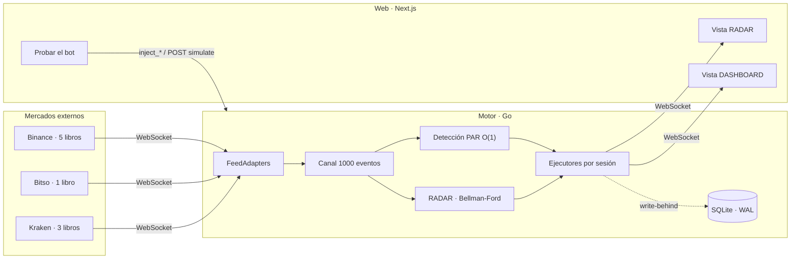
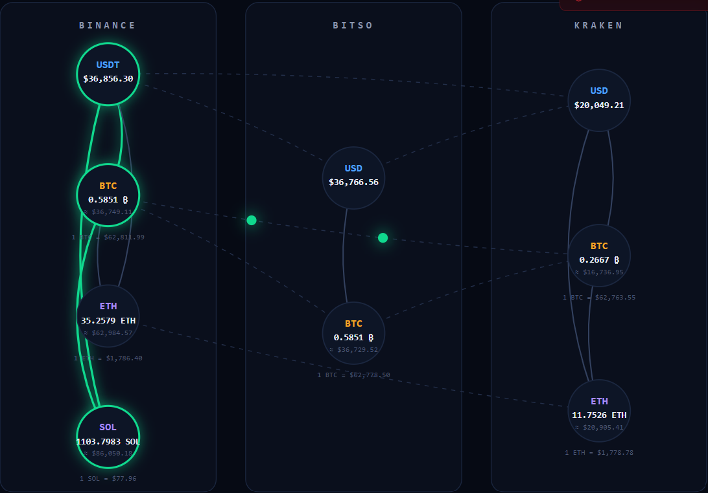
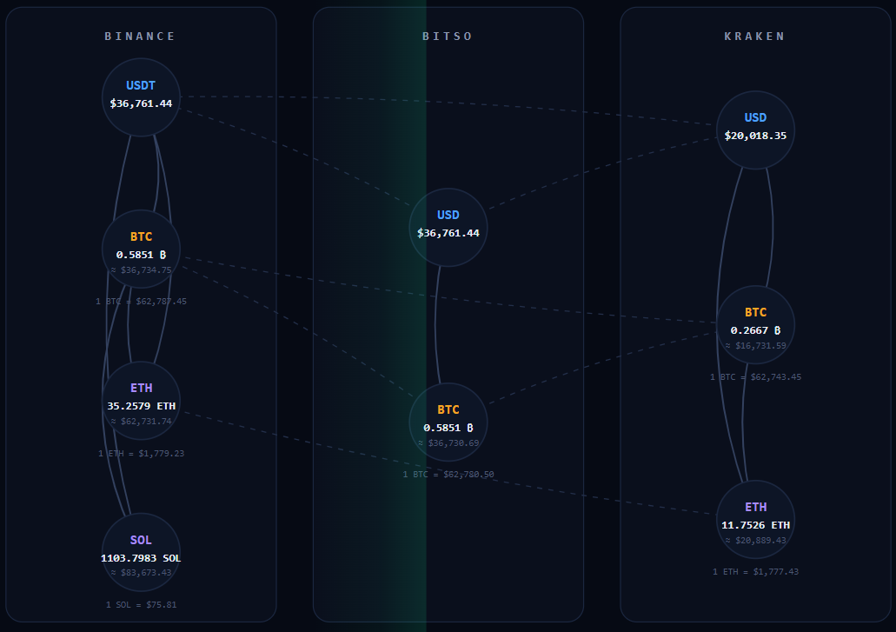
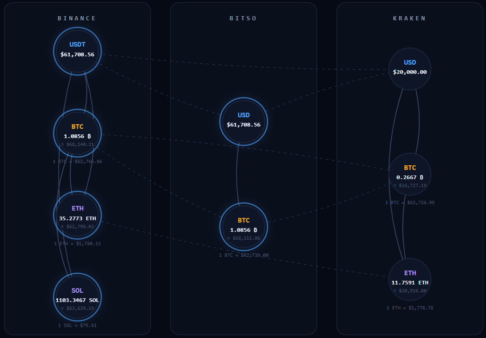
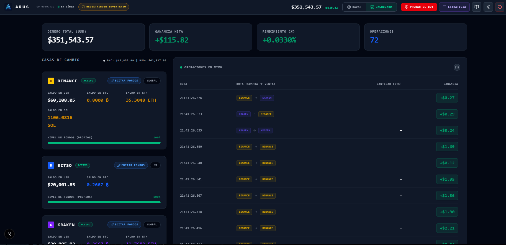
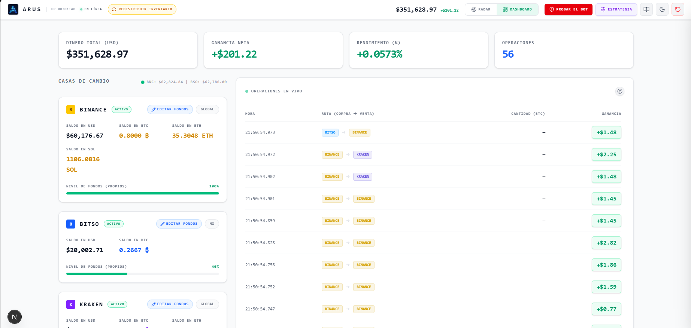
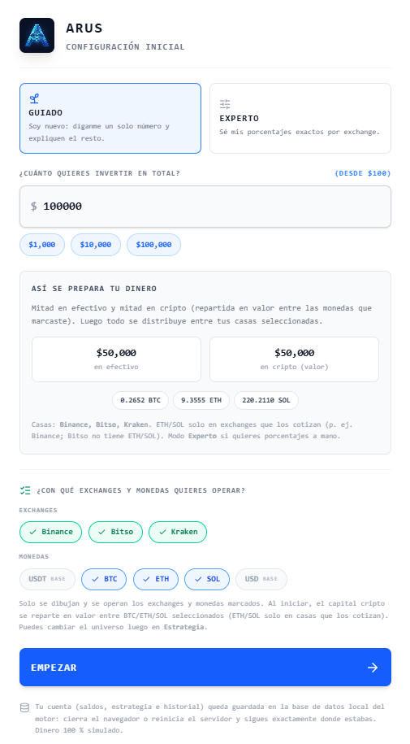
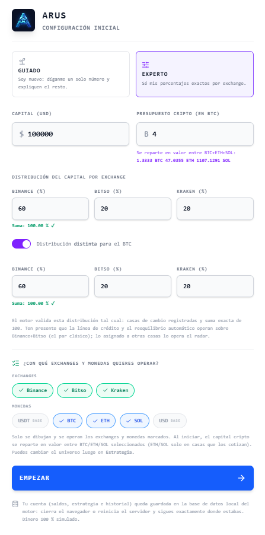
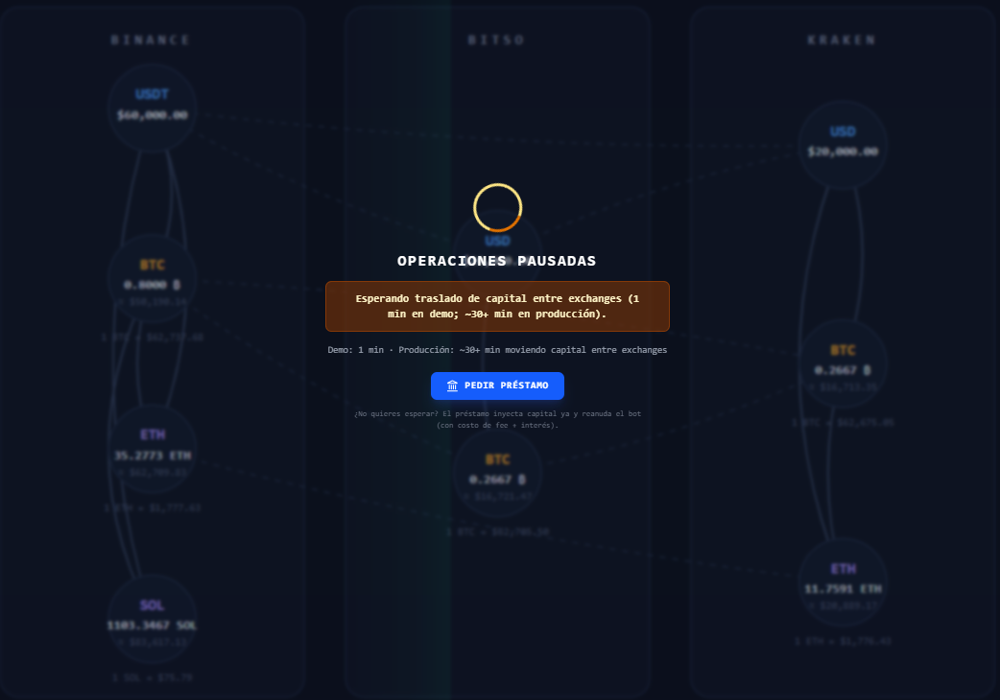
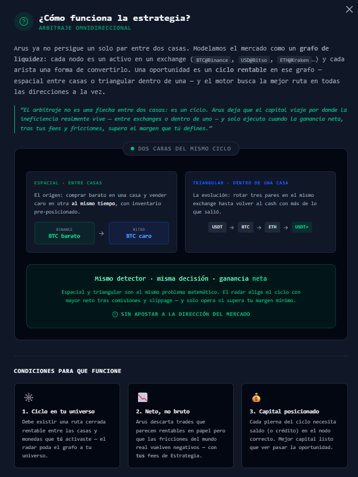

<div align="center">

# ⬡ ARUS

### Motor de arbitraje omnidireccional de alta frecuencia · multi-exchange · multi-activo

> Plataforma **production-ready** de arbitraje cripto: grafo de liquidez en vivo, ejecución atómica, sesiones persistidas y terminal institucional conectada por WebSocket. Datos 100 % reales de **Binance, Bitso y Kraken**.


**Autor:** Daniel Peredo Borgonio · **Reto:** CODING_CHALLENGE_MEXICO

🔗 **Demo en vivo:** **[arus-snowy.vercel.app](https://arus-snowy.vercel.app)** · ⚙️ Motor (API): [arus-engine.fly.dev/api/ledger](https://arus-engine.fly.dev/api/ledger)

</div>

---

## 📑 Índice

1. [Resumen ejecutivo](#-resumen-ejecutivo)
2. [Filosofía del producto — cuatro pilares](#-filosofía-del-producto--cuatro-pilares)
3. [El problema y la solución](#-el-problema-y-la-solución)
4. [Estrategia e inteligencia del bot](#-estrategia-e-inteligencia-del-bot)
5. [El Radar Omnidireccional (grafo de liquidez)](#-el-radar-omnidireccional-grafo-de-liquidez)
6. [Velocidad y eficiencia](#-velocidad-y-eficiencia-detección-de-oportunidades)
7. [Precisión del cálculo de rentabilidad neta](#-precisión-del-cálculo-de-rentabilidad-neta)
8. [Robustez y gestión de riesgo](#-robustez-y-gestión-de-riesgo-circuit-breakers)
9. [Auditoría interna y pruebas de estrés](#-auditoría-interna-y-pruebas-de-estrés)
10. [Persistencia y continuidad](#-persistencia-y-continuidad-sesiones-completas--trade-ledger)
11. [Arquitectura y stack tecnológico](#-arquitectura-y-stack-tecnológico)
12. [Interfaz y experiencia de usuario](#-interfaz-y-experiencia-de-usuario)
13. [Parámetros y configuración — referencia completa](#️-parámetros-y-configuración--referencia-completa)
14. [Instalación y ejecución local](#-instalación-y-ejecución-local)
15. [Despliegue](#-despliegue)
16. [Capturas de pantalla](#-capturas-de-pantalla)
17. [Licencia](#-licencia)

---

## 🎯 Resumen ejecutivo

**Arus** es un motor de **arbitraje omnidireccional**: modela el mercado como un **grafo de liquidez** donde cada nodo es un activo en un exchange (`BTC@Binance`, `USD@Bitso`, `ETH@Kraken`…) y cada arista una forma de convertirlo (libros de órdenes reales, paridad USDT≈USD, inventario pre-fondeado). Una oportunidad de arbitraje es un **ciclo rentable** en ese grafo — comprar barato y vender caro entre exchanges (espacial) o rotar tres pares dentro de uno (triangular) son el mismo problema matemático, detectado con Bellman-Ford sobre pesos `−log(tasa·(1−fee))`, cada segundo, con datos 100 % reales de **Binance, Bitso y Kraken** (9 libros de órdenes en vivo).

El sistema descuenta comisiones y slippage *antes* de decidir, dimensiona cada orden contra la liquidez visible del libro y deja al **usuario** parametrizar margen, riesgo, universo de mercados y términos del crédito — todo editable en vivo, validado por el backend y **persistido** en SQLite.

---

## 🏛️ Filosofía del producto — cuatro pilares

Arus no es un bot de spread bruto: es una plataforma de arbitraje con disciplina institucional. Descansa en cuatro pilares verificables en el código:

| Pilar | Principio | Implementación en el motor |
|---|---|---|
| **La Física Real del Dinero** | Solo opera cuando la ganancia **neta** supera el margen del usuario, tras fees y slippage en cada pierna | `computeNetProfit` (engine.go) — única fórmula para detección, ejecución del par, ciclos del radar, simulador y benchmarks |
| **Eficiencia de Capital** | El capital no duerme: línea de crédito instantánea cuando la rentabilidad domina el costo | `creditWorthIt`, `cycleCreditProjection`, `handleLiquidityShortfall` — inecuación `ganancia > costo × RiskMultiplier` en modo clásico y radar |
| **Control Absoluto del Usuario** | El riesgo lo define quien opera, no el sistema | 16 parámetros por sesión (`set_params`), onboarding guiado/experto, universo podable, presets Conservador/Balanceado/Agresivo |
| **Escudo de Robustez** | Ante fallas de exchange, no queda exposición direccional | Fill-or-Kill atómico antes de mutar wallets, Spike Filter, staleness, `MaxDivergenceRatio`, evento `CIRCUIT_BREAKER` + Emergency Unwind preventivo |

---

## 💡 El problema y la solución

El error clásico del arbitraje novato es operar sobre el **spread bruto** (`Ask < Bid`) ignorando que cada operación tiene costos que pueden volverla negativa. Arus parte de modelar esos costos.

| | Arbitraje ingenuo | **Arus** |
|---|---|---|
| Señal de entrada | Spread bruto positivo | Ciclo con tasa **neta** > margen del usuario, tras fees + slippage |
| Comisiones | Se asumen "despreciables" | Modeladas por exchange y **personalizables** (cuentas VIP pagan menos) |
| Slippage | Ignorado | Estimado por pierna (configurable) y descontado antes de decidir |
| Alcance | Un par fijo | **Grafo omnidireccional**: espacial + triangular con el mismo detector |
| Volumen | Fijo | `min(tope del usuario, liquidez real del libro en cada pierna)` |
| Anomalías de precio | Se opera sobre ellas | **Spike Filter** + staleness + compuertas de divergencia |
| Falta de fondos | Se detiene o falla | Decisión crédito-vs-reequilibrio con análisis de rentabilidad |
| Estado | Volátil / en memoria | **Sesiones completas persistidas** + ledger inmutable de auditoría |

---

## 🧠 Estrategia e inteligencia del bot

El motor opera con **dos estrategias conmutables por el usuario**:

- **Modo clásico (default):** arbitraje espacial del par BTC entre Binance y Bitso con fondos pre-posicionados en ambos lados — compra y venta **simultáneas**. Evalúa las **dos** direcciones cada tick y ejecuta la de **mayor neto**.
- **Modo radar / autopiloto (opt-in):** el grafo de liquidez completo. El motor busca cada segundo el mejor **ciclo** dentro del universo del usuario — espacial o **triangular** — con los fees de ESE usuario en los pesos, y lo ejecuta atómicamente si supera SU margen.

### ⭐ La capa de inteligencia financiera (crédito vs. reequilibrio)

Cuando un exchange agota su inventario, reponerlo exige transferencias on-chain de **~30+ minutos**. Arus modela una línea de crédito instantánea cuyos **términos define cada usuario** y decide según:

```
pedir préstamo ⇔ ganancia proyectada > costo del crédito × RiskMultiplier
```

El préstamo es **siempre temporal**: al vencer se devuelve y el inventario del par vuelve a 50/50. Un crédito activo **jamás se persiste como capital del usuario**.

---

## 📡 El Radar Omnidireccional (grafo de liquidez)

El mercado se modela como un **grafo dirigido** (diseño completo en [`docs/FASE2-GRAFO.md`](docs/FASE2-GRAFO.md)):

| Concepto | En el grafo |
|---|---|
| Un activo en un venue (`BTC@Binance`, `USD@Bitso`) | **Nodo** — con el saldo real del usuario superpuesto |
| Comprar/vender en un libro de órdenes | **Arista de libro** (tasa = top-of-book real, fee = taker del usuario + slippage) |
| USDT ≈ USD | **Arista de paridad** visible y etiquetada |
| Mismo activo en dos exchanges pre-fondeados | **Arista de inventario** |
| Oportunidad de arbitraje | **Ciclo de peso negativo** — detectado por Bellman-Ford |

**Topología actual:** **9 nodos** y **32 aristas** (Binance: triángulos BTC/ETH/SOL · Bitso: BTC/USD · Kraken: triángulo BTC/ETH). Agregar un exchange = entrada en el registro + adaptador de feed, **cero cambios en la lógica de decisión**.

---

## ⚡ Velocidad y eficiencia (detección de oportunidades)

**Núcleo de detección — latencia medida, no estimada.** El hot path (mids, Spike Filter, fees, slippage, neto y decisión) es **O(1)**:

```
BenchmarkOpportunityDetection-12     ~56 ns/op                  tick completo: Spike Filter + ambas direcciones + decisión
BenchmarkNetProfitBothDirections-12  ~7.3 ns/op   0 allocs/op   decisión del par (lo que corre executeForSession)
BenchmarkNetProfitCalculation-12     ~3–21 ns/op  0 allocs/op   fórmula neta aislada
(Intel i5-12450H · go test -bench · tracker thread-safe · cifras del reporte de estrés)
```

≈ **18 millones de evaluaciones completas por segundo y por núcleo** (tick completo); la aritmética neta aislada corre **sin asignaciones**. Reproducible con:

```bash
cd apps/engine && go test -bench=Detection -benchmem -run=^$
cd apps/engine && go test -overlay tests/overlay.json -bench=BenchmarkNetProfit -benchmem -run=^$ .
```

**Ingesta 100 % WebSocket nativo, sin polling:**

| Plano | Mecanismo | Latencia |
|---|---|---|
| Exchanges → motor | WebSocket push (Binance streams combinados · Bitso `orders` · Kraken ticker v2) | Cada cambio del top-of-book |
| Motor → navegador | WebSocket `/ws` (gorilla) | Operaciones: inmediatas · Radar: coalescido ~1/s |

**Optimizaciones:** canal con búfer (1 000 eventos), Spike Filter O(1), una goroutine por sesión, persistencia **write-behind** (disco nunca frena el trading).

---

## 🎯 Precisión del cálculo de rentabilidad neta

Una única fórmula gobierna TODAS las decisiones — `computeNetProfit` en engine.go:

```
Neto = (P_venta × V × (1 − fee_venta)) − (P_compra × V × (1 + fee_compra)) − Slippage
```

- **Fees por exchange** en ambas piernas, personalizables por sesión
- **Slippage estimado** descontado antes de decidir (default 5 bps/pierna)
- **Volumen dimensionado** contra liquidez real del libro
- **Umbral personal** por usuario — evita *fee bleeding*
- **P&L limpio:** `InitialWealth` se mueve con depósitos/retiros

---

## 🛡️ Robustez y gestión de riesgo (circuit breakers)

- **Feed congelado (staleness >10 s):** aristas excluidas del grafo; evaluación pausada
- **Spike Filter en dos capas:** ingesta global (5 %) + tolerancia por sesión (`spike_tick_deviation`)
- **Divergencia entre casas:** aborta si supera `MaxDivergenceRatio` del usuario
- **Fill-or-Kill atómico:** fallo de orden evaluado **antes** de mover saldos — cero exposición direccional
- **Doble hard block de fondos:** validación al planificar y bajo lock justo antes del commit
- **Cooldown 3 s** + `IsExecuting` serializa ejecuciones (cierra ventana TOCTOU)
- **Apalancamiento disciplinado:** nunca se pide crédito que no cubra `costo × RiskMultiplier`

El botón **«Precio falso / error»** en *Probar el bot* (`inject_fake`, circuit.go) provoca anomalías reales (spike de ingesta, timeout FoK, divergencia) y el motor las **rechaza** emitiendo `CIRCUIT_BREAKER` — sin luces verdes ni mutación de capital.

---

## 🔬 Auditoría interna y pruebas de estrés

Suite concentrada en `apps/engine/tests/` (compilada vía overlay sobre `package main` para acceso white-box). Reporte completo: [`apps/engine/tests/STRESS_TEST_REPORT.md`](apps/engine/tests/STRESS_TEST_REPORT.md).

### Ejecución

```bash
cd apps/engine/tests && ./run_tests.sh    # Linux/macOS/Git Bash
cd apps/engine/tests && .\run_tests.ps1   # Windows PowerShell

# Manual
cd apps/engine
go test -v -count=1 .                                                    # 90+ unit tests (raíz)
go test -overlay tests/overlay.json -v -count=1 -run 'TestStress|TestCredit|TestParams' .
go test -overlay tests/overlay.json -bench=BenchmarkNetProfit -benchmem -run=^$ .
```

### Resultados verificados (julio 2026)

| Categoría | Test | Resultado |
|---|---|---|
| **Benchmarks algorítmicos** | `BenchmarkNetProfitCalculation` (~3–21 ns/op) · `BenchmarkOpportunityDetection` (~56 ns/op) | PASS — fórmula neta 0 allocs; hot path O(1) |
| **Alta volatilidad** | `TestStressHighVolatility_SpikeRejection` | PASS — 100 ticks concurrentes; Spike Filter descarta; PnL = 0 |
| **Latencia / slippage** | `TestStressLatencyRisk_SlippageAbort` | PASS — re-cotización aborta; capital intacto |
| **Falla de exchange** | `TestStressExchangeFailure_CircuitBreaker` | PASS — FoK atómico; `PausedUntil` activo |
| **«La Pata Coja»** | `TestStressAdverse_PataCoja_EmergencyUnwind` | PASS — compra ACK en Binance + TIMEOUT en Bitso → `[CIRCUIT BREAKER]` + `[EMERGENCY UNWIND]`; delta neutral; pérdida $0 |
| **Eficiencia de capital** | `TestStressCapitalEfficiency_MXNBCreditRebalance` | PASS — auto-crédito cuando ganancia > costo × k |
| **Thread-safety** | `TestParamsConcurrency_AtomicHotSwap` · `TestParamsConcurrency_ExecuteWhileMutating` | PASS — `atomic.Pointer` bajo 64 lectores WS + escritor REST |
| **Presión de mutex** | `TestStressAdverse_ConcurrentExecutions_MutexPressure` | PASS — 32 goroutines; sin estado corrupto |

Frontend: `npm test` — 14 tests del layout paramétrico del radar (vitest). CI: `go vet` + `go test -race` + vitest + builds en cada push.

### Smoke E2E de *Probar el bot*

Scripts Node (≥ 21) validan el flujo WebSocket sin reiniciar el motor:

```bash
cd apps/engine && node smoke_omni.mjs      # Oportunidad normal → omni_executed
cd apps/engine && node smoke_storm.mjs     # Evento poco común → storm_trade
cd apps/engine && node smoke_circuit.mjs     # Precio falso → CIRCUIT_BREAKER
cd apps/engine && node smoke_custom_sim.mjs  # POST /api/simulate/custom
```

---

## 💾 Persistencia y continuidad (sesiones completas + Trade Ledger)

Arus persiste en SQLite **la sesión completa de cada usuario**: saldos multi-activo, estrategia, PnL y preferencias sobreviven a reinicios del motor **y** del navegador. Token UUID v4 en `localStorage` → `resume_session` recupera todo sin login.

- **Esquema multi-activo:** tabla `balances (session_id, venue, asset, amount)`
- **Patrón repositorio:** interfaz `SessionStore` — migrar a Postgres es escribir otro driver
- **Write-behind:** cada mutación dispara fotografía asíncrona vía `sendWalletUpdate`
- **Sin préstamos fantasma:** la fotografía persiste solo fondos PROPIOS

### Trade Ledger (auditoría inmutable)

| Endpoint | Qué devuelve |
|---|---|
| `GET /api/ledger?session_id=<uuid>` | Últimos 100 registros de TU sesión |
| `GET /api/stats?session_id=<uuid>` | P&L acumulado, win rate, ops/hora, fricción total |
| `GET /api/ledger.csv?session_id=<uuid>` | Historial completo como CSV |

### ¿Por qué SQLite embebida?

Un proceso, un escritor (write-behind), lecturas esporádicas — el patrón exacto de SQLite. Transaccional ACID, un archivo en el volumen de Fly.io, esquema auto-migrado al arrancar. La interfaz `SessionStore` deja la puerta abierta a Postgres si aparecen múltiples instancias del motor.

---

## 🏗️ Arquitectura y stack tecnológico


```mermaid
flowchart LR
    subgraph EXT["Mercados externos"]
        BIN["Binance · 5 libros"]
        BIT["Bitso · 1 libro"]
        KRK["Kraken · 3 libros"]
    end

    subgraph ENGINE["Motor · Go"]
        WS["FeedAdapters"]
        CH["Canal 1000 eventos"]
        EVAL["Detección PAR O(1)"]
        GRAPH["RADAR · Bellman-Ford"]
        EXEC["Ejecutores por sesión"]
        DB[("SQLite · WAL")]
    end

    subgraph WEB["Web · Next.js"]
        RADAR["Vista RADAR"]
        UI["Vista DASHBOARD"]
        SIM["Probar el bot"]
    end

    BIN & BIT & KRK -->|WebSocket| WS --> CH --> EVAL --> EXEC
    CH --> GRAPH --> EXEC
    EXEC -->|WebSocket| UI & RADAR
    SIM -->|inject_* / POST simulate| ENGINE
    EXEC -.->|write-behind| DB
```

| Capa | Tecnología | Justificación |
|---|---|---|
| Motor | **Go 1.26** | Goroutines + channels para bucle de eventos sin bloqueos |
| Comunicación | **WebSocket** (gorilla) | Tiempo real en ambos extremos |
| Persistencia | **SQLite** (modernc.org/sqlite) | CGO-free; detrás de `SessionStore` |
| Frontend | **Next.js 16 / React 19** | App Router, TypeScript end-to-end |
| Estilos | **Tailwind CSS 4** | Modo oscuro persistente, responsive |
| CI | **GitHub Actions** | `go test -race` + vitest + builds |

**Organización clave del motor:**

```
apps/engine/
├── engine.go      # computeNetProfit, bucle Start, ejecutor clásico, crédito
├── graph.go       # LiquidityGraph, Bellman-Ford
├── cycle.go       # planCycle + commitCycle + autopiloto
├── simulate.go    # POST /api/simulate/custom (tubería real)
├── omni.go        # inject_omni — oportunidad omnidireccional
├── storm.go       # inject_storm — ráfaga HFT
├── circuit.go     # inject_fake — escudo de robustez
├── server.go      # WebSocket hub, set_params, handlers
├── store.go       # SessionStore + SQLite
└── tests/         # Suite de estrés + benchmarks (overlay)
```

---

## 🖥️ Interfaz y experiencia de usuario

Web app **Radar-first** ([`docs/REDISENO-RADAR.md`](docs/REDISENO-RADAR.md)): el grafo de liquidez es la pantalla principal; el dashboard concentra P&L, wallets, ledger y analítica.

### Terminal institucional en tiempo real

- **WebSocket persistente** (`useArusEngine.ts`): P&L, patrimonio animado, feed de operaciones y ledger por sesión
- **Vista RADAR:** grafo SVG a pantalla completa, revelación progresiva (hover → tooltip, click → card de nodo), partículas en el ciclo rentable, luz verde por trade, tematización claro/oscuro vía `--radar-*`
- **Vista DASHBOARD:** KPIs, salud de inventario por venue, donut de distribución de capital, historial/auditoría, analítica con curva de P&L y export CSV
- **Onboarding adaptativo:** modo Guiado (un número + presets) y Experto (matriz de % por exchange validada en UI y backend)

### ⚡ Probar el bot — banco de pruebas sin reiniciar el motor

Accesible desde el header en **ambas vistas**. Inyecta escenarios por el **mismo pipeline** que los feeds reales — misma `computeNetProfit`, mismos circuit breakers, mismo ejecutor:

| Escenario | Acción | Comportamiento verificado |
|---|---|---|
| **Oportunidad normal** | `inject_omni` | Fabrica ineficiencia en libros reales → radar descubre ciclo → `planCycle`/`commitCycle` → `omni_executed` + animación |
| **Evento poco común** | `inject_storm` | Ráfaga concurrente (7.5 s, 2 workers) → `storm_trade` por fill → mutex estable |
| **Precio falso / error** | `inject_fake` | Spike / timeout FoK / divergencia → `CIRCUIT_BREAKER` efímero, capital intacto |
| **Crear tu propia prueba** | `POST /api/simulate/custom` | Dos libros definidos por el usuario → `publishTick` en canal de ingesta |

---

## ⚙️ Parámetros y configuración — referencia completa

Fuente de verdad viva: `GET /api/config` — cada parámetro con default, rango y catálogo de venues.

### Parámetros por sesión (editables EN VIVO)

| Parámetro (wire) | Qué controla | Default |
|---|---|---|
| `min_net_profit_usd` | Umbral de ganancia neta | $0.10 |
| `max_order_size_btc` | Tope de volumen | 0.005 BTC |
| `slippage_rate` | Slippage por pierna | 5 bps |
| `spike_tick_deviation` | Spike Filter por sesión | 5 % |
| `max_divergence_ratio` | Divergencia máxima entre casas | 1.20 |
| `risk_multiplier` | Inecuación del crédito | 1.0 |
| `order_failure_prob` | Prob. Fill-or-Kill (simulador) | 5 % |
| `enabled_venues` / `enabled_assets` | Universo (poda del grafo) | todos |
| `radar_autopilot` | Detección → ejecución de ciclos | off |

Bloque completo de crédito (`credit_line_usd`, `credit_line_btc`, `credit_apr`, `credit_origination_fee`, `credit_duration_min`) y comisiones por venue — ver `GET /api/config`.

### Variables de entorno

| Variable | Default |
|---|---|
| `PORT` | `8080` |
| `ARUS_CATALOG` | `./venues.json` si existe |
| `ARUS_DB_PATH` | `data/ledger.db` |

Frontend: `NEXT_PUBLIC_ENGINE_WS_URL` y `NEXT_PUBLIC_ENGINE_HTTP_URL` (ver `apps/web/.env.example`).

---

## 🚀 Instalación y ejecución local

> Sistema funcional en **menos de 2 minutos**. Sin Docker ni base de datos externa.

### Prerrequisitos

| Software | Versión |
|---|---|
| **Go** | 1.26+ |
| **Node.js** | 18+ (smokes E2E: 21+) |
| **npm** | 9+ |

### 1) Motor

```bash
cd apps/engine
go run .
# :8080 — crea data/ledger.db automáticamente
```

### 2) Dashboard

```bash
cd apps/web
npm install
npm run dev
# http://localhost:3000
```

### 3) Validar continuidad

1. Configura capital, opera con **Probar el bot**
2. Mata el motor, reinícialo, recarga el navegador → **«Recuperando tu sesión…»** → todo persiste

### Tests

```bash
cd apps/engine && go test ./...
cd apps/engine/tests && .\run_tests.ps1
cd apps/web && npm test
```

---

## ☁️ Despliegue

| Componente | Plataforma |
|---|---|
| **Frontend** | **Vercel** (root: `apps/web`) |
| **Motor** | **Fly.io** (volumen persistente `data/`) |

```bash
flyctl auth login
cd apps/engine
flyctl deploy
```

Variables en Vercel:

```
NEXT_PUBLIC_ENGINE_WS_URL=wss://arus-engine.fly.dev/ws
NEXT_PUBLIC_ENGINE_HTTP_URL=https://arus-engine.fly.dev
```

---

## 📸 Capturas de pantalla

### Vista RADAR — grafo de liquidez en acción

El radar es la pantalla principal: columnas por exchange, nodos con saldo en vivo, ciclo rentable resaltado y dinamismo HFT.







### Vista DASHBOARD — terminal institucional

P&L acumulado, salud de inventario, feed de operaciones y precios en vivo.





### Onboarding y configuración

<table>
<tr>
<td width="50%" valign="top"><br><sub>Modo Guiado: un solo número, presets desde $100, reparto 50/50 explicado.</sub></td>
<td width="50%" valign="top"><br><sub>Modo Experto: matriz de % por exchange, suma 100 validada en UI y backend.</sub></td>
</tr>
</table>

### Crédito, fondos y operaciones pausadas

<table>
<tr>
<td width="42%" valign="top"><br><sub>Depósito/retiro por venue — ajusta la base del P&L sin distorsionar rendimiento.</sub></td>
<td width="58%" valign="top"><br><sub>Decisión asistida: crédito vs. reequilibrio cuando faltan fondos.</sub></td>
</tr>
</table>

### Tutorial y guía

<table>
<tr>
<td width="50%" valign="top"><br><sub>Tutorial radar-first de 8 pasos con chip de ubicación de cada elemento.</sub></td>
<td width="50%" valign="top"><br><sub>Guía de los cuatro pilares y flujo operativo del bot.</sub></td>
</tr>
</table>

---

## 📄 Licencia

Este proyecto se distribuye bajo la **licencia MIT** — eres libre de usar, copiar, modificar y distribuir el código, citando la autoría. El texto completo está en [`LICENSE`](LICENSE).

---

<div align="center">

**Arus** · CODING_CHALLENGE_MEXICO · Daniel Peredo Borgonio · Licencia MIT

*Motor de arbitraje omnidireccional — production-ready*

</div>
